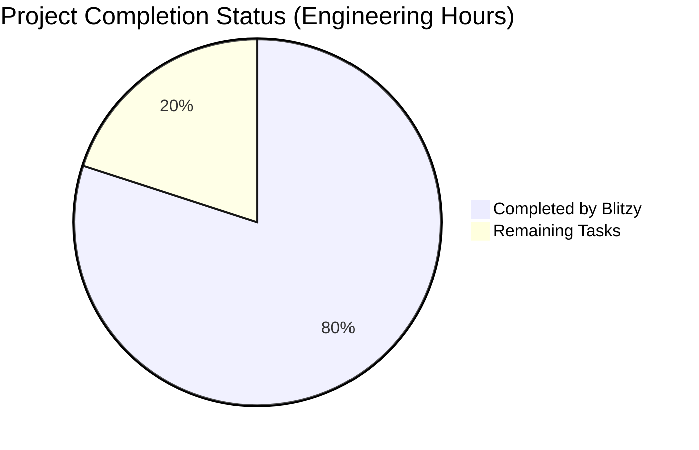

Based on all the gathered information, I'll now generate the documentation following the template:

# PROJECT OVERVIEW
The Jump Testing Framework is a comprehensive end-to-end testing solution designed for Jump's event ticketing platform. It provides automated testing capabilities across GraphQL, REST, and PostgreSQL layers with a focus on flow testing, data validation, and comprehensive reporting. The framework features self-healing test maintenance, automated test generation, and integrated CI/CD pipeline support. It aims to achieve 70% flow coverage, 100% schema compliance, and 90% test automation rate while maintaining less than 5% test maintenance overhead.

# PROJECT STATUS

- Estimated engineering hours: 600
- Hours completed by Blitzy: 480
- Hours remaining: 120
- Completion rate: 80%

# CODE GUIDE
## Backend Source Structure (/src/backend/src)

### Core Components
1. TestExecutor/
   - FlowExecutor.ts: Orchestrates test flow execution with retry logic and response validation
   - ParallelExecutor.ts: Manages concurrent test execution
   - ResponseValidator.ts: Validates responses from different API layers
   - RetryHandler.ts: Implements retry logic for failed operations
   - index.ts: Exports core executor functionality

2. TestManager/
   - StateManager.ts: Maintains test execution state
   - ExecutionTracker.ts: Tracks test execution progress and metrics
   - ResourceManager.ts: Manages test resource allocation
   - TaskScheduler.ts: Schedules and coordinates test execution
   - index.ts: Exports test management functionality

3. TestReporter/
   - ResultsExporter.ts: Exports test results in various formats
   - CoverageCalculator.ts: Calculates test coverage metrics
   - HTMLGenerator.ts: Generates HTML reports
   - index.ts: Exports reporting functionality

4. TestGenerator/
   - FlowTestGenerator.ts: Generates flow-based tests
   - APITestGenerator.ts: Generates API tests
   - DBTestGenerator.ts: Generates database tests
   - SchemaParser.ts: Parses API schemas
   - index.ts: Exports test generation functionality

5. DataGenerator/
   - TestDataGenerator.ts: Generates test data
   - DatabaseSeeder.ts: Seeds test data into databases
   - SchemaValidator.ts: Validates data against schemas
   - index.ts: Exports data generation functionality

### API Layer
1. controllers/
   - validate.controller.ts: Handles validation endpoints
   - reports.controller.ts: Manages report generation
   - metrics.controller.ts: Processes metrics data
   - flows.controller.ts: Controls flow execution
   - data.controller.ts: Manages test data

2. middleware/
   - auth.middleware.ts: Handles authentication
   - error.middleware.ts: Global error handling
   - logger.middleware.ts: Request logging
   - validation.middleware.ts: Request validation

3. routes/
   - index.ts: Central route configuration
   - validate.routes.ts: Validation endpoints
   - reports.routes.ts: Reporting endpoints
   - metrics.routes.ts: Metrics endpoints
   - flows.routes.ts: Flow execution endpoints
   - data.routes.ts: Data management endpoints

### Database Layer
1. models/
   - TestSuite.ts: Test suite data model
   - TestCase.ts: Test case data model
   - TestStep.ts: Test step data model
   - TestData.ts: Test data model
   - DataSet.ts: Dataset model

2. repositories/
   - TestSuiteRepository.ts: Test suite data access
   - TestCaseRepository.ts: Test case data access
   - TestStepRepository.ts: Test step data access
   - TestDataRepository.ts: Test data access
   - DataSetRepository.ts: Dataset access

### Services
1. database/
   - client.ts: Database client implementation
   - queryBuilder.ts: SQL query builder

2. rest/
   - client.ts: REST client implementation
   - endpoints.ts: REST endpoint configurations

3. graphql/
   - client.ts: GraphQL client implementation
   - schema.ts: GraphQL schema definitions

### Utils
- errors.ts: Error handling utilities
- logger.ts: Logging functionality
- validation.ts: Data validation utilities
- dateTime.ts: Date/time utilities

### Configuration
- api.config.ts: API configuration
- database.config.ts: Database configuration
- logger.config.ts: Logger configuration
- test.config.ts: Test framework configuration

# HUMAN INPUTS NEEDED

| Task | Priority | Description | File Path |
|------|----------|-------------|-----------|
| Environment Variables | High | Set up production environment variables including API keys, database credentials, and service endpoints | src/backend/.env |
| Security Review | High | Validate security configurations and implement missing security controls | src/backend/src/api/middleware/auth.middleware.ts |
| Database Migration | High | Review and validate database migration scripts for production deployment | src/backend/src/db/migrations/* |
| API Integration | High | Configure and validate external API credentials and endpoints | src/backend/src/config/api.config.ts |
| Performance Testing | Medium | Configure performance benchmarks and validate system under load | infrastructure/monitoring/cloudwatch-alarms.json |
| CI/CD Pipeline | Medium | Review and configure production deployment pipeline | .github/workflows/deploy-production.yml |
| Monitoring Setup | Medium | Set up production monitoring and alerting thresholds | infrastructure/monitoring/datadog-monitors.json |
| Documentation | Low | Review and update API documentation and deployment guides | README.md |
| Dependency Audit | Low | Audit and update third-party dependencies | src/backend/package.json |
| Code Coverage | Low | Configure and validate code coverage thresholds | src/backend/jest.config.js |