### 1.1 PURPOSE

This Software Requirements Specification (SRS) document provides a comprehensive description of the Jump Testing Framework, a specialized end-to-end testing solution for Jump's event ticketing platform. The document is intended for:

| Audience | Usage |
| --- | --- |
| Development Team | Implementation guidance and technical requirements |
| QA Engineers | Test planning and validation criteria |
| Project Managers | Project scope and milestone planning |
| System Architects | System design and integration requirements |
| Stakeholders | Understanding system capabilities and limitations |

The document aims to:
- Define functional and non-functional requirements
- Establish system boundaries and interfaces
- Specify performance criteria and quality metrics
- Document technical constraints and dependencies
- Provide a basis for system validation and acceptance

### 1.2 SCOPE

The Jump Testing Framework encompasses an automated testing solution designed to validate the complete event ticketing ecosystem, including:

#### Core Capabilities

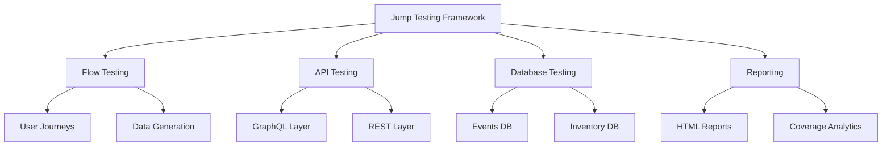

#### Functional Scope

| Component | In Scope | Out of Scope |
| --- | --- | --- |
| Test Generation | - Flow-based test cases<br>- Data-driven scenarios<br>- API test generation | - UI test generation<br>- Performance test creation |
| Test Execution | - End-to-end flows<br>- API validation<br>- Database verification | - UI automation<br>- Load testing<br>- Security scanning |
| Data Management | - Test data generation<br>- Database seeding<br>- State management | - Production data migration<br>- Data archival |
| Reporting | - HTML test reports<br>- Coverage metrics<br>- Failure analysis | - Custom dashboards<br>- Business analytics |

#### Integration Boundaries

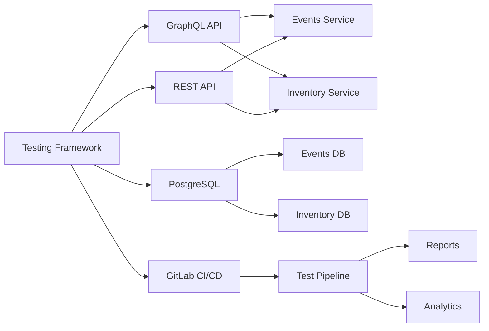

The framework will integrate with Jump's existing technology stack while maintaining clear boundaries and separation of concerns. It focuses on technical testing aspects without extending into business intelligence or operational monitoring domains.

### 2. PRODUCT DESCRIPTION

### 2.1 PRODUCT PERSPECTIVE

The Jump Testing Framework operates as a critical component within Jump's event ticketing ecosystem, integrating with multiple services and systems:

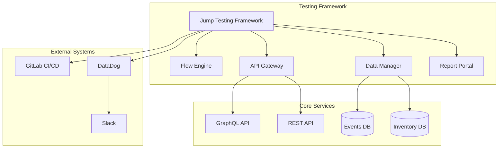

| Integration Point | Purpose | Interface Type |
|------------------|---------|----------------|
| GraphQL API | Primary event and inventory data access | GraphQL over HTTPS |
| REST API | Secondary operations and management | REST over HTTPS |
| PostgreSQL DBs | Direct data validation and seeding | Native database drivers |
| GitLab CI/CD | Test automation and reporting | API/Webhook integration |
| DataDog | Monitoring and analytics | Metrics API |
| Slack | Notifications and alerts | Webhook integration |

### 2.2 PRODUCT FUNCTIONS

The framework provides the following core functions:

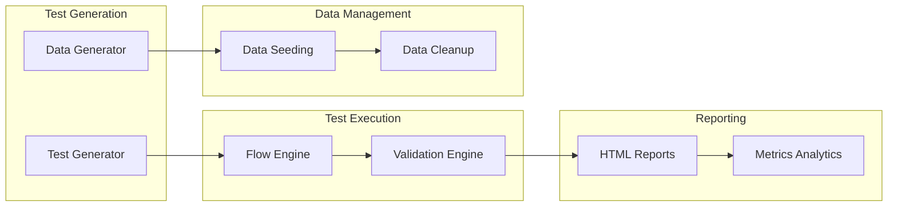

| Function Category | Capabilities |
|------------------|--------------|
| Test Generation | - Flow-based test case generation<br>- Data-driven scenario creation<br>- API test synthesis |
| Test Execution | - End-to-end flow validation<br>- API request/response verification<br>- Database state confirmation |
| Data Management | - Test data generation<br>- Database seeding<br>- State cleanup |
| Reporting | - HTML test reports<br>- Coverage metrics<br>- Failure analysis |

### 2.3 USER CHARACTERISTICS

#### User Personas

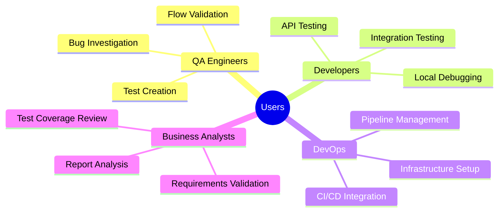

| User Type | Technical Level | Primary Use Cases |
|-----------|----------------|-------------------|
| QA Engineers | Advanced | - Creating test flows<br>- Validating business logic<br>- Investigating failures |
| Developers | Expert | - Testing API changes<br>- Local development<br>- Debugging issues |
| DevOps Engineers | Expert | - Pipeline configuration<br>- Infrastructure management<br>- Monitoring setup |
| Business Analysts | Intermediate | - Report review<br>- Coverage analysis<br>- Requirements verification |

### 2.4 CONSTRAINTS

#### 2.4.1 Technical Constraints

| Constraint Type | Description | Impact |
|----------------|-------------|---------|
| Performance | Must complete test suites within CI/CD time limits | Test parallelization and optimization required |
| Security | Must comply with SOC 2 requirements | Secure credential handling and audit logging needed |
| Integration | Must support existing GraphQL/REST APIs | Strict schema compliance and version management |
| Infrastructure | Must run in containerized environments | Docker-based deployment and scaling |

#### 2.4.2 Business Constraints

| Constraint Type | Description | Impact |
|----------------|-------------|---------|
| Timeline | Must be operational before peak season | Phased deployment approach |
| Resources | Limited QA team bandwidth | Automation and self-service focus |
| Budget | Fixed infrastructure cost allocation | Efficient resource utilization |
| Compliance | PCI DSS requirements for payment flows | Additional security controls |

### 2.5 ASSUMPTIONS AND DEPENDENCIES

#### 2.5.1 Assumptions

| Category | Assumption | Validation Method |
|----------|------------|------------------|
| Technical | GraphQL/REST APIs maintain backward compatibility | Schema validation |
| Data | Test data can be generated synthetically | Data validation |
| Infrastructure | CI/CD pipelines provide required resources | Resource monitoring |
| Integration | External systems have test environments | Environment verification |

#### 2.5.2 Dependencies

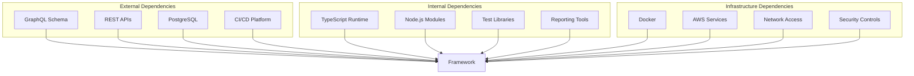

| Dependency Type | Component | Version/Details | Criticality |
|----------------|-----------|-----------------|-------------|
| External Services | GraphQL API | Latest schema | High |
| External Services | REST API | v1 endpoints | High |
| Infrastructure | PostgreSQL | 14+ | High |
| Infrastructure | GitLab CI/CD | Latest | Medium |
| Software | Node.js | LTS version | High |
| Software | TypeScript | 4.8+ | High |
| Network | API Access | Secure routes | High |
| Security | SSO Integration | SAML 2.0 | Medium |

### 3.8 PROCESS FLOWCHART

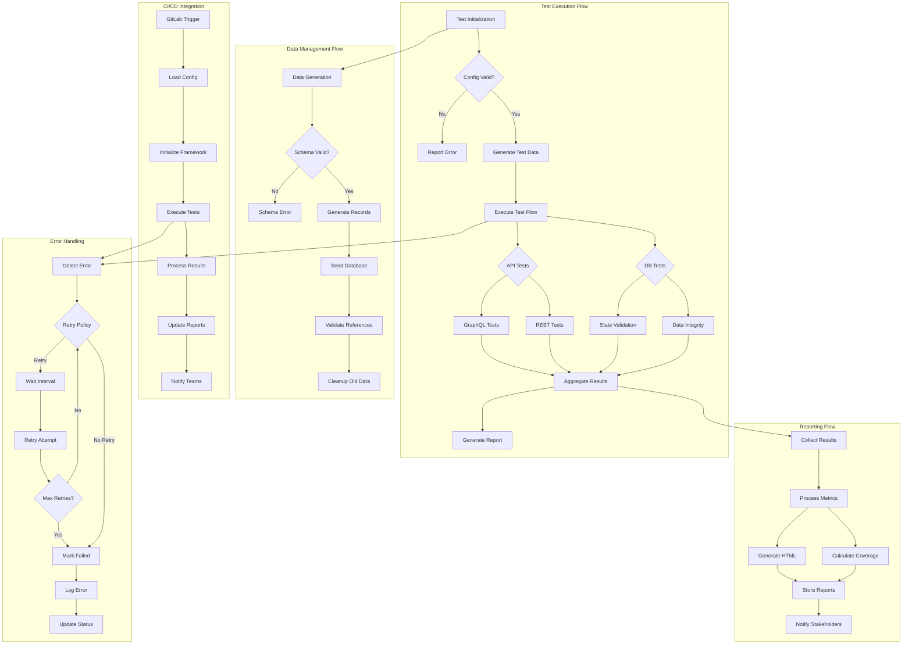

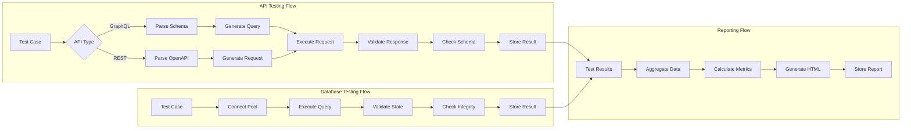

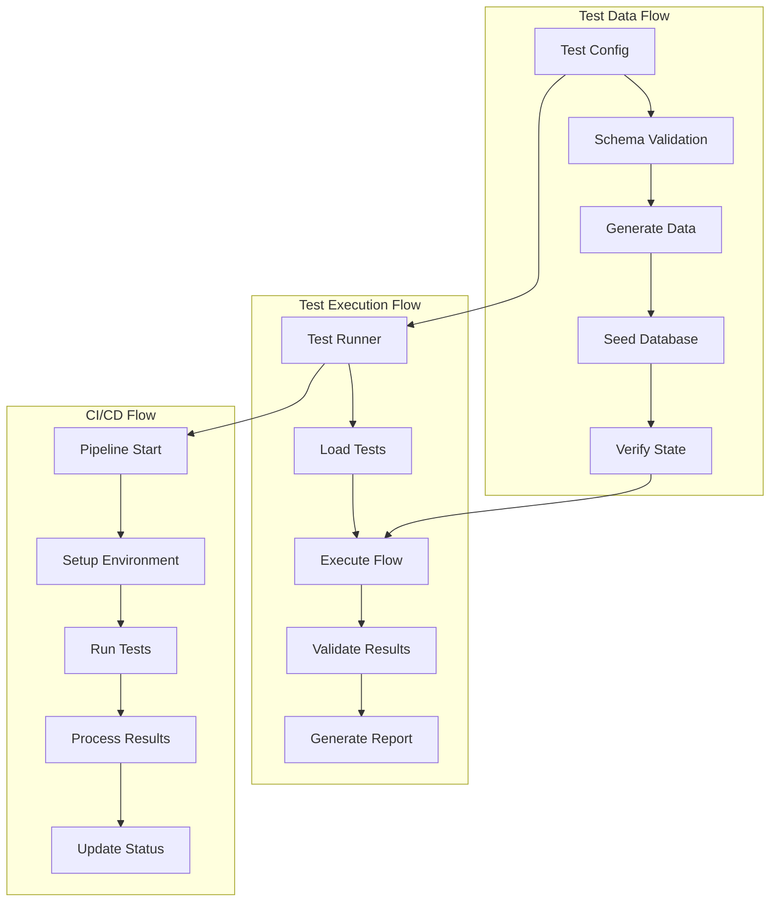

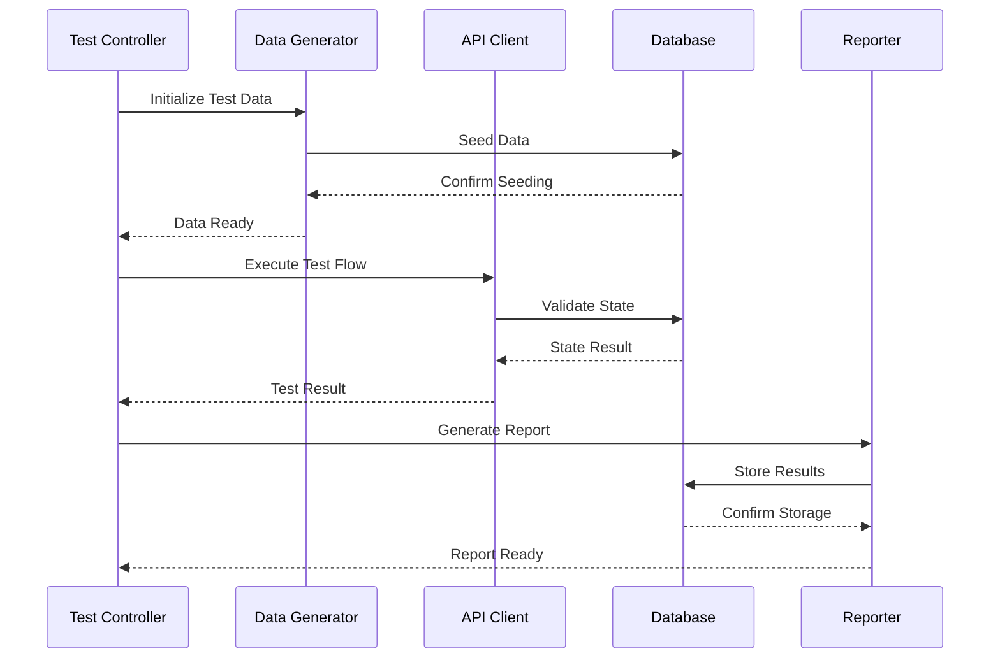

## 3. FUNCTIONAL REQUIREMENTS

### 3.1 Flow Testing Engine

#### ID: FT-001
#### Description: Core test flow execution engine for running end-to-end test scenarios
#### Priority: HIGH

| ID | Requirement | Validation |
|---|-------------|------------|
| FT-001.1 | Execute test flows based on GraphQL/REST API sequences | Verify flow completion and response validation |
| FT-001.2 | Support parallel test execution with configurable concurrency | Measure execution time improvements |
| FT-001.3 | Handle test data dependencies and state management | Validate data consistency across flows |
| FT-001.4 | Implement retry logic for transient failures | Confirm retry attempts and success rates |
| FT-001.5 | Maintain flow execution history and metrics | Verify metrics collection and reporting |

### 3.2 Test Data Generation

#### ID: TDG-001  
#### Description: Dynamic test data generation and seeding capabilities
#### Priority: HIGH

| ID | Requirement | Validation |
|---|-------------|------------|
| TDG-001.1 | Generate synthetic test data based on GraphQL/DB schemas | Validate schema compliance |
| TDG-001.2 | Support referential integrity across generated entities | Check data relationships |
| TDG-001.3 | Seed test databases with generated data | Verify database state |
| TDG-001.4 | Clean up test data after flow execution | Confirm data removal |
| TDG-001.5 | Handle complex data scenarios and edge cases | Test boundary conditions |

### 3.3 API Testing Layer

#### ID: API-001
#### Description: GraphQL and REST API testing capabilities
#### Priority: HIGH

| ID | Requirement | Validation |
|---|-------------|------------|
| API-001.1 | Execute GraphQL queries and mutations | Verify response format |
| API-001.2 | Validate REST API requests and responses | Check status codes and payloads |
| API-001.3 | Support schema validation for API responses | Confirm schema compliance |
| API-001.4 | Handle API authentication and authorization | Test security controls |
| API-001.5 | Track API performance metrics | Monitor response times |

### 3.4 Database Testing

#### ID: DB-001
#### Description: Database state validation and verification
#### Priority: MEDIUM

| ID | Requirement | Validation |
|---|-------------|------------|
| DB-001.1 | Execute direct database queries for validation | Verify query results |
| DB-001.2 | Compare database state before/after operations | Check state changes |
| DB-001.3 | Support transaction management | Validate ACID properties |
| DB-001.4 | Handle database connection pooling | Monitor connection usage |
| DB-001.5 | Validate database constraints and integrity | Test data consistency |

### 3.5 Test Reporting

#### ID: REP-001
#### Description: Comprehensive test execution reporting
#### Priority: MEDIUM

| ID | Requirement | Validation |
|---|-------------|------------|
| REP-001.1 | Generate HTML test execution reports | Verify report format |
| REP-001.2 | Calculate and display test coverage metrics | Check metric accuracy |
| REP-001.3 | Track test execution history | Validate historical data |
| REP-001.4 | Support failure analysis and debugging | Test debug capabilities |
| REP-001.5 | Export results in JUnit format | Verify CI/CD integration |

### 3.6 CI/CD Integration

#### ID: CI-001
#### Description: Integration with GitLab CI/CD pipelines
#### Priority: HIGH

| ID | Requirement | Validation |
|---|-------------|------------|
| CI-001.1 | Execute tests in CI/CD pipelines | Verify pipeline integration |
| CI-001.2 | Support parallel test execution | Check concurrent runs |
| CI-001.3 | Generate pipeline artifacts | Validate artifact storage |
| CI-001.4 | Integrate with GitLab reporting | Test report visibility |
| CI-001.5 | Handle pipeline environment variables | Verify configuration |

### 3.7 Configuration Management

#### ID: CFG-001
#### Description: Test framework configuration and management
#### Priority: MEDIUM

| ID | Requirement | Validation |
|---|-------------|------------|
| CFG-001.1 | Support environment-specific configurations | Test env switching |
| CFG-001.2 | Handle test suite organization | Verify suite structure |
| CFG-001.3 | Manage test dependencies | Check dependency resolution |
| CFG-001.4 | Configure execution parameters | Validate parameter usage |
| CFG-001.5 | Support plugin architecture | Test plugin loading |

### 3.8 Error Handling

#### ID: ERR-001
#### Description: Comprehensive error handling and recovery
#### Priority: HIGH

| ID | Requirement | Validation |
|---|-------------|------------|
| ERR-001.1 | Implement global error handling | Verify error capture |
| ERR-001.2 | Support custom error types | Test error classification |
| ERR-001.3 | Provide detailed error reporting | Check error details |
| ERR-001.4 | Handle async operation failures | Test async error handling |
| ERR-001.5 | Support error recovery strategies | Verify recovery paths |

### 3.9 Monitoring Integration

#### ID: MON-001
#### Description: Integration with monitoring systems
#### Priority: LOW

| ID | Requirement | Validation |
|---|-------------|------------|
| MON-001.1 | Send metrics to DataDog | Verify metric delivery |
| MON-001.2 | Support custom metric tags | Test tag propagation |
| MON-001.3 | Track test execution metrics | Check metric accuracy |
| MON-001.4 | Generate monitoring alerts | Validate alert triggers |
| MON-001.5 | Support metric aggregation | Test metric rollups |

### 3.10 Security Testing

#### ID: SEC-001
#### Description: Security validation capabilities
#### Priority: MEDIUM

| ID | Requirement | Validation |
|---|-------------|------------|
| SEC-001.1 | Validate authentication flows | Test auth scenarios |
| SEC-001.2 | Support role-based access testing | Verify permission checks |
| SEC-001.3 | Handle secure credential storage | Test credential security |
| SEC-001.4 | Validate API security headers | Check header presence |
| SEC-001.5 | Support SSL/TLS validation | Test secure connections |

## 4. NON-FUNCTIONAL REQUIREMENTS

### 4.1 PERFORMANCE

#### 4.1.1 Response Time

| Operation | Target Time | Maximum Time |
|-----------|-------------|--------------|
| Test Flow Execution | < 30 seconds | 60 seconds |
| API Request/Response | < 200ms | 500ms |
| Database Operations | < 100ms | 300ms |
| Report Generation | < 30 seconds | 60 seconds |
| Data Generation | < 5 seconds | 15 seconds |

#### 4.1.2 Throughput

| Metric | Requirement |
|--------|------------|
| Concurrent Test Flows | 50 flows minimum |
| API Requests/Second | 200 requests minimum |
| Database Transactions/Second | 100 transactions minimum |
| Report Generation/Hour | 100 reports minimum |

#### 4.1.3 Resource Usage

| Resource | Limit |
|----------|-------|
| CPU Usage | < 70% sustained |
| Memory Usage | < 80% of available RAM |
| Database Connections | < 80% of connection pool |
| Storage Growth | < 10GB per day |

### 4.2 SAFETY

#### 4.2.1 Data Safety

| Requirement | Implementation |
|-------------|----------------|
| Data Backup | Automated daily backups with 30-day retention |
| State Recovery | Automatic rollback on failed test flows |
| Data Validation | Schema validation before persistence |
| Error Handling | Comprehensive error capture and logging |

#### 4.2.2 System Safety

| Requirement | Implementation |
|-------------|----------------|
| Circuit Breaking | Automatic service isolation on failure |
| Rate Limiting | Request throttling to prevent overload |
| Resource Protection | Automatic resource cleanup |
| Deadlock Prevention | Transaction timeout limits |

### 4.3 SECURITY

#### 4.3.1 Authentication & Authorization

| Requirement | Implementation |
|-------------|----------------|
| User Authentication | SSO integration with Jump's identity system |
| Role-Based Access | Granular permissions for test operations |
| API Security | JWT-based authentication |
| Session Management | Secure session handling with timeouts |

#### 4.3.2 Data Security

| Requirement | Implementation |
|-------------|----------------|
| Data Encryption | AES-256 for data at rest |
| Transport Security | TLS 1.3 for data in transit |
| Credential Management | HashiCorp Vault integration |
| PII Protection | Data masking for sensitive information |

### 4.4 QUALITY

#### 4.4.1 Availability

| Metric | Target |
|--------|--------|
| System Uptime | 99.9% |
| Service Availability | 99.95% during business hours |
| Planned Downtime | < 4 hours per month |
| Recovery Time | < 15 minutes |

#### 4.4.2 Maintainability

| Requirement | Implementation |
|-------------|----------------|
| Code Coverage | > 80% test coverage |
| Documentation | Up-to-date technical and user documentation |
| Version Control | GitLab-based source control |
| Dependency Management | Automated dependency updates |

#### 4.4.3 Usability

| Requirement | Implementation |
|-------------|----------------|
| Interface Consistency | Standardized UI components |
| Error Messages | Clear, actionable error feedback |
| Documentation | Comprehensive user guides |
| Accessibility | WCAG 2.1 AA compliance |

#### 4.4.4 Scalability

| Requirement | Implementation |
|-------------|----------------|
| Horizontal Scaling | Support for multiple test runners |
| Data Volume | Handle 1M+ test records |
| Concurrent Users | Support 100+ simultaneous users |
| Resource Scaling | Automatic container scaling |

#### 4.4.5 Reliability

| Metric | Target |
|--------|--------|
| Mean Time Between Failures | > 720 hours |
| Mean Time To Recovery | < 15 minutes |
| Error Rate | < 0.1% of operations |
| Data Consistency | 100% after recovery |

### 4.5 COMPLIANCE

#### 4.5.1 Legal Requirements

| Requirement | Implementation |
|-------------|----------------|
| GDPR Compliance | Data privacy controls |
| Data Retention | Configurable retention policies |
| Audit Logging | Comprehensive activity tracking |
| Data Sovereignty | Region-specific data storage |

#### 4.5.2 Industry Standards

| Standard | Compliance Level |
|----------|-----------------|
| SOC 2 | Type II compliance |
| PCI DSS | Level 1 for payment flows |
| ISO 27001 | Security controls alignment |
| OWASP | Security best practices |

#### 4.5.3 Regulatory Requirements

| Requirement | Implementation |
|-------------|----------------|
| Access Controls | Role-based permissions |
| Data Protection | Encryption and masking |
| Audit Trails | Immutable audit logs |
| Reporting | Compliance reporting capabilities |

## 5. DATA REQUIREMENTS

### 5.1 DATA MODELS

#### 5.1.1 Core Domain Models

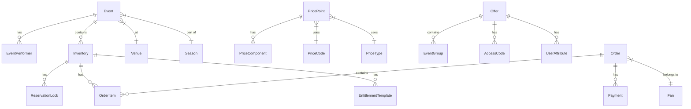

#### 5.1.2 Test Data Models

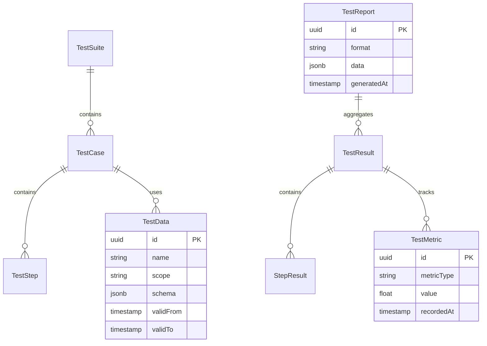

### 5.2 DATA STORAGE

#### 5.2.1 Primary Storage

| Database | Purpose | Configuration |
|----------|---------|---------------|
| Events PostgreSQL | Event and venue data | - High availability with streaming replication<br>- Point-in-time recovery<br>- 30-day retention window |
| Inventory PostgreSQL | Inventory and pricing data | - Partitioning by organization<br>- Connection pooling<br>- Automated backups every 6 hours |
| Test Results PostgreSQL | Test execution data | - Regular pruning (90 days)<br>- Compression enabled<br>- Daily backups |

#### 5.2.2 Data Redundancy

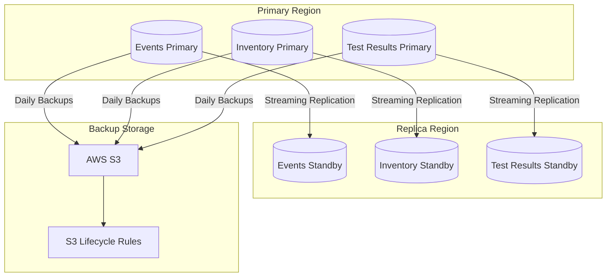

#### 5.2.3 Backup Strategy

| Type | Frequency | Retention | Storage |
|------|-----------|-----------|----------|
| Full Backup | Daily | 30 days | AWS S3 |
| Incremental Backup | 6 hours | 7 days | AWS S3 |
| WAL Archiving | Continuous | 7 days | AWS S3 |
| Test Results | Weekly | 90 days | AWS S3 |

### 5.3 DATA PROCESSING

#### 5.3.1 Data Flow

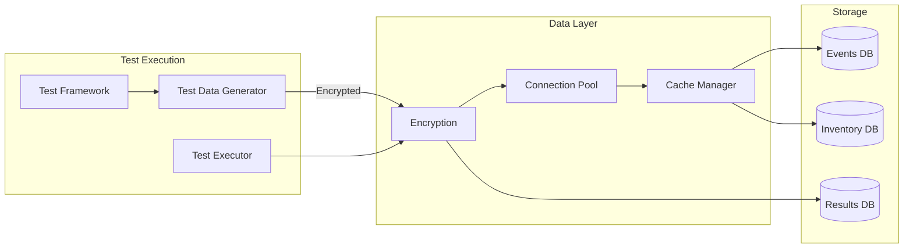

#### 5.3.2 Data Security

| Layer | Security Measure | Implementation |
|-------|-----------------|----------------|
| Transport | TLS 1.3 | Strong cipher suites only |
| Storage | AES-256 | Database-level encryption |
| Application | Data Masking | PII/sensitive data masking |
| Access | Row-Level Security | Organization-based isolation |

#### 5.3.3 Data Validation

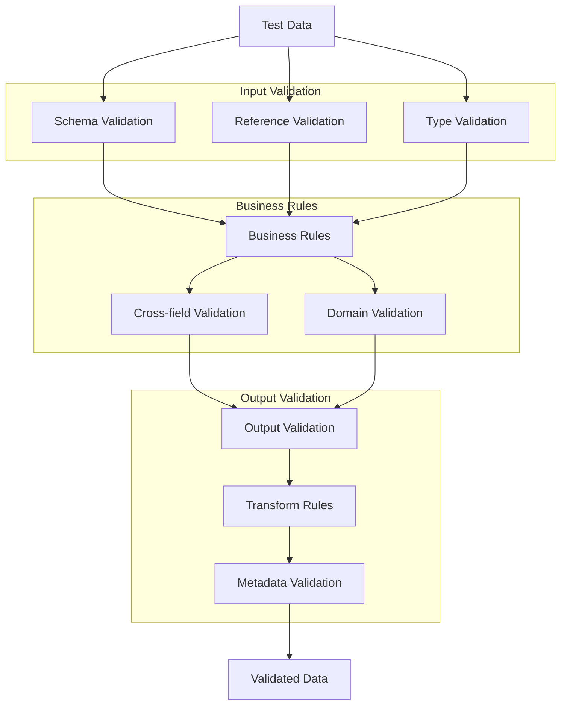

### 5.4 DATA RETENTION

| Data Type | Retention Period | Archival Strategy |
|-----------|------------------|-------------------|
| Test Results | 90 days active, 1 year archived | S3 with lifecycle rules |
| Test Reports | 30 days active, 1 year archived | S3 with compression |
| Test Metrics | 180 days active, 2 years archived | Aggregated storage |
| Test Data | Duration of test + 7 days | Automatic cleanup |
| Audit Logs | 1 year active, 7 years archived | Compliance storage |

### 5.5 DATA RECOVERY

#### 5.5.1 Recovery Objectives

| Metric | Target |
|--------|--------|
| Recovery Time Objective (RTO) | < 1 hour |
| Recovery Point Objective (RPO) | < 5 minutes |
| Maximum Tolerable Downtime | 4 hours |
| Data Loss Tolerance | Zero |

#### 5.5.2 Recovery Procedures

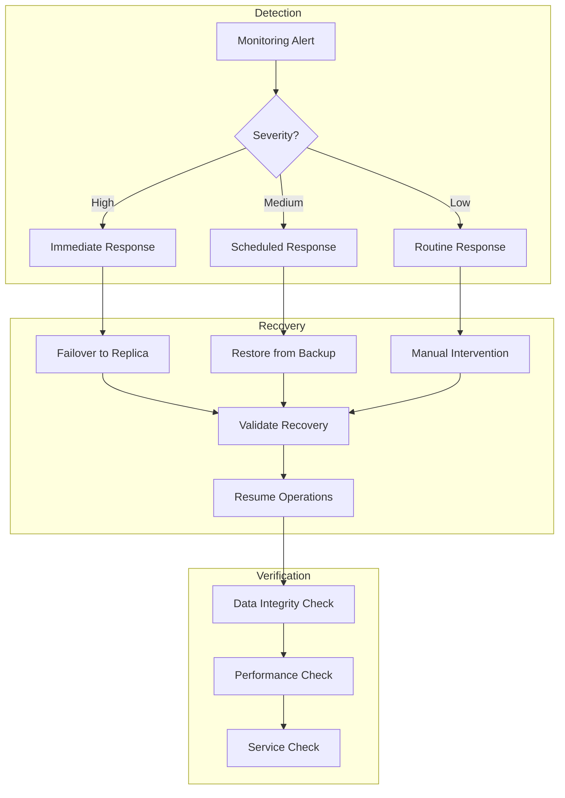

## 3. EXTERNAL INTERFACES

### 3.1 USER INTERFACES

The Jump Testing Framework provides the following user interfaces:

#### 3.1.1 Web Dashboard Interface

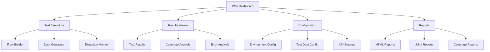

| Interface Component | Requirements |
|-------------------|--------------|
| Flow Builder | - Drag-and-drop test flow creation<br>- GraphQL/REST request configuration<br>- Data dependency mapping |
| Results Viewer | - Real-time test execution status<br>- Detailed error information<br>- Test history and trends |
| Configuration | - Environment management<br>- Credential storage<br>- API endpoint configuration |
| Reports | - Customizable HTML reports<br>- JUnit XML export<br>- Coverage metrics visualization |

#### 3.1.2 CLI Interface

| Command | Purpose | Options |
|---------|---------|---------|
| test:run | Execute test flows | --flow, --env, --parallel |
| test:generate | Generate test data | --schema, --count, --output |
| test:report | Generate reports | --format, --output, --coverage |
| test:config | Manage configuration | --set, --get, --env |

### 3.2 SOFTWARE INTERFACES

#### 3.2.1 GraphQL API Integration

```typescript
interface GraphQLInterface {
  endpoint: string;
  headers: {
    authorization: string;
    'content-type': 'application/json';
  };
  schema: GraphQLSchema;
  maxRetries: number;
  timeout: number;
}
```

#### 3.2.2 REST API Integration

```typescript
interface RESTInterface {
  baseUrl: string;
  endpoints: {
    events: string;
    inventory: string;
    pricing: string;
  };
  authentication: {
    type: 'JWT' | 'Bearer';
    token: string;
  };
  timeout: number;
}
```

#### 3.2.3 Database Interface

```typescript
interface DatabaseInterface {
  type: 'PostgreSQL';
  connection: {
    host: string;
    port: number;
    database: string;
    schema: string;
    ssl: boolean;
  };
  poolConfig: {
    min: number;
    max: number;
    idleTimeout: number;
  };
}
```

#### 3.2.4 CI/CD Integration

```typescript
interface CIInterface {
  provider: 'GitLab';
  pipeline: {
    configPath: string;
    artifacts: string[];
    timeout: number;
  };
  reporting: {
    junitPath: string;
    coveragePath: string;
  };
}
```

### 3.3 COMMUNICATION INTERFACES

#### 3.3.1 Network Protocols

| Protocol | Usage | Configuration |
|----------|-------|---------------|
| HTTPS | API Communication | TLS 1.3, Certificate validation |
| WebSocket | Real-time Updates | Secure WebSocket, Auto-reconnect |
| TCP/IP | Database Connection | Connection pooling, Keep-alive |

#### 3.3.2 Message Formats

```typescript
interface MessageFormats {
  api: {
    request: 'JSON' | 'GraphQL';
    response: 'JSON';
    encoding: 'UTF-8';
  };
  events: {
    format: 'JSON';
    schema: 'AsyncAPI';
    validation: boolean;
  };
  reports: {
    formats: ['HTML', 'JSON', 'XML'];
    compression: 'gzip';
  };
}
```

#### 3.3.3 Integration Points

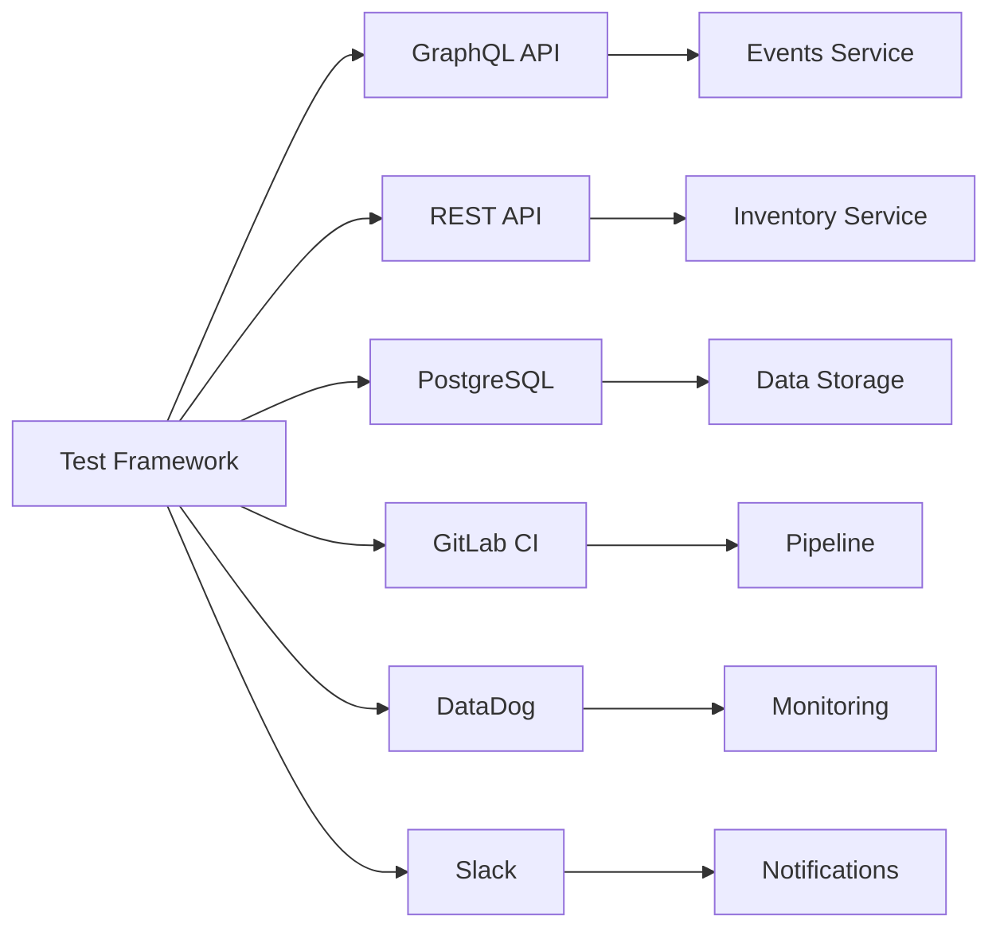

#### 3.3.4 Data Exchange Formats

| Interface | Format | Schema | Validation |
|-----------|--------|---------|------------|
| GraphQL API | GraphQL/JSON | Schema-based | Runtime validation |
| REST API | JSON | OpenAPI 3.0 | Request/Response validation |
| Database | Binary | SQL Schema | Constraint checking |
| Reports | HTML/XML/JSON | Custom Schema | Structure validation |
| Metrics | StatsD | Metric Schema | Type checking |

#### 3.3.5 Security Protocols

| Protocol | Purpose | Implementation |
|----------|---------|----------------|
| TLS 1.3 | Transport Security | Certificate validation |
| JWT | API Authentication | RSA signing |
| SSL | Database Connection | Certificate verification |
| SAML 2.0 | SSO Integration | Identity federation |

## APPENDICES

### A.1 GLOSSARY

| Term | Definition |
| --- | --- |
| Availability Token | Unique identifier used to reserve specific inventory items during test flows |
| Block | Collection of inventory items sharing common attributes (location, pricing) |
| Entitlement Template | Definition of access rights and permissions for inventory items |
| Fan Profile | User account containing customer information and preferences |
| Flow Coverage | Percentage of user journeys covered by automated tests |
| Gate Access Level | Permission level for physical or digital venue access points |
| Inventory Lock | Temporary reservation of inventory during test execution |
| Price Component | Additional fees or charges applied to base ticket prices |
| Price Point | Specific price for a combination of price code and type |
| Reservation | Temporary hold on inventory items during purchase process |
| Test Flow | Complete end-to-end user journey through the system |
| Venue Access | Physical or digital entry permissions for events |

### A.2 ACRONYMS

| Acronym | Definition |
| --- | --- |
| API | Application Programming Interface |
| CI/CD | Continuous Integration/Continuous Delivery |
| DB | Database |
| GDPR | General Data Protection Regulation |
| HTML | HyperText Markup Language |
| IGX | In-Game Exchange |
| JSON | JavaScript Object Notation |
| JWT | JSON Web Token |
| NPM | Node Package Manager |
| REST | Representational State Transfer |
| SQL | Structured Query Language |
| SSO | Single Sign-On |
| TLS | Transport Layer Security |
| UUID | Universally Unique Identifier |

### A.3 ADDITIONAL REFERENCES

| Reference | Description | URL |
| --- | --- | --- |
| Jest Documentation | Testing framework documentation | https://jestjs.io/docs/getting-started |
| GraphQL Documentation | GraphQL specification and guides | https://graphql.org/learn/ |
| PostgreSQL Documentation | Database reference | https://www.postgresql.org/docs/ |
| TypeScript Handbook | Language documentation | https://www.typescriptlang.org/docs/ |
| GitLab CI Documentation | CI/CD pipeline configuration | https://docs.gitlab.com/ee/ci/ |
| DataDog API Reference | Monitoring integration guides | https://docs.datadoghq.com/api/ |
| Node.js Best Practices | Development guidelines | https://github.com/goldbergyoni/nodebestpractices |
| AWS SDK Documentation | Cloud service integration | https://docs.aws.amazon.com/sdk-for-javascript/ |

### A.4 SCHEMA REFERENCES

The following database schemas are critical for test data generation and validation:

1. Events Database Schema
- Event management tables
- Venue and performer information
- Season and group relationships

2. Inventory Database Schema  
- Inventory item tracking
- Price points and components
- Reservation management
- Entitlement templates

3. GraphQL Schema
- Event queries and mutations
- Inventory operations
- Fan profile management
- Order processing

4. REST API Schema
- Event management endpoints
- Inventory control operations
- Price point configuration
- Template management

Detailed schema definitions are maintained in the project repository under `/docs/schemas/`.

### A.5 ENVIRONMENT CONFIGURATION

| Environment | Purpose | Configuration |
| --- | --- | --- |
| Development | Local testing | - Local PostgreSQL instances<br>- Mock external services<br>- Debug logging enabled |
| Integration | CI/CD testing | - Dedicated test databases<br>- Containerized services<br>- Test metrics collection |
| Staging | Pre-production | - Production-like setup<br>- Sanitized test data<br>- Full monitoring |
| Production | Live testing | - Read-only operations<br>- Limited test scope<br>- Alert integration |

### A.6 SECURITY CONSIDERATIONS

| Area | Requirements | Implementation |
| --- | --- | --- |
| Data Privacy | GDPR compliance | - Data masking<br>- Retention policies<br>- Access controls |
| Authentication | SSO integration | - JWT tokens<br>- Role-based access<br>- Session management |
| API Security | TLS encryption | - Certificate validation<br>- Rate limiting<br>- Request signing |
| Test Data | Data protection | - Synthetic data generation<br>- Secure storage<br>- Cleanup procedures |