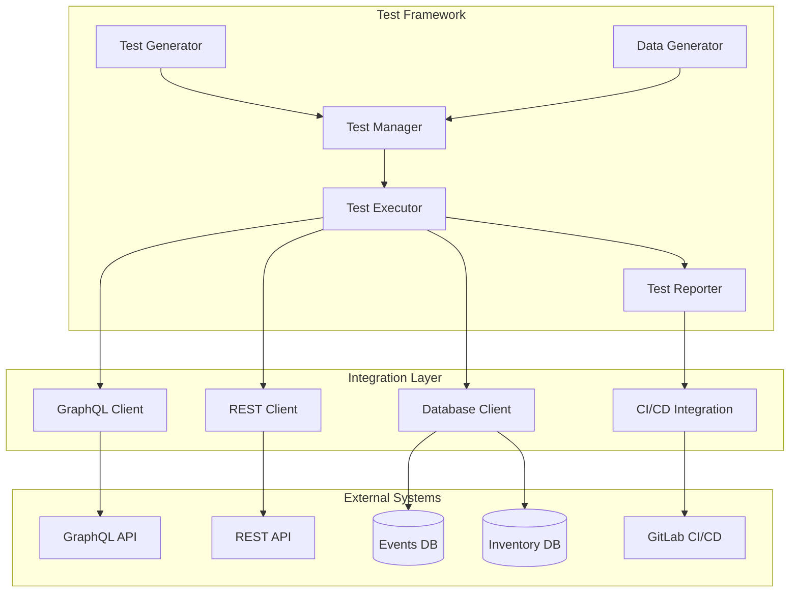

## 1. INTRODUCTION

### 1.1 SYSTEM OBJECTIVES

The Jump Testing Framework aims to provide comprehensive end-to-end testing capabilities for Jump's event ticketing platform with the following key objectives:

| Objective | Description | Success Metric |
| --- | --- | --- |
| Flow Coverage | Enable testing of complete user journeys through the system | 70% coverage of identified flows |
| Data Validation | Ensure data integrity across GraphQL, REST, and PostgreSQL layers | 100% schema compliance |
| Test Automation | Automate test generation and execution in CI/CD pipelines | 90% test automation rate |
| Self-Healing | Maintain test stability through system changes | <5% test maintenance overhead |
| Reporting | Provide actionable insights on test results and coverage | 100% visibility of test outcomes, JUnit format compatibility |


### 1.2 SCOPE

The Jump Testing Framework encompasses:

### Core Functionalities

| Component | In Scope | Out of Scope |
| --- | --- | --- |
| Test Generation | - Flow-based test cases
- Data-driven scenarios
- API test generation | - UI test generation
- Performance test creation |
| Test Execution | - End-to-end flows
- API validation
- Database verification | - UI automation
- Load testing
- Security scanning |
| Data Management | - Test data generation
- Database seeding
- State management | - Production data migration
- Data archival |
| Reporting | - HTML test reports
- Coverage metrics
- Failure analysis | - Custom dashboards
- Business analytics |

### Integration Points


The framework will integrate with Jump's existing technology stack while maintaining clear boundaries and separation of concerns. It focuses on technical testing aspects without extending into business intelligence or operational monitoring domains.

## 2. SYSTEM ARCHITECTURE

### 2.1 High-Level Architecture Overview



### 2.2 Component Architecture

### 2.2.1 Core Components


### 2.3 Integration Architecture

### 2.3.1 API Integration Layer


### 2.3.2 Database Integration Layer


### 2.4 Data Flow Architecture


### 2.5 Deployment Architecture


### 2.6 Security Architecture


### 3.1 Core Testing Components


### 3.2 Component Interaction Sequences

### 3.2.1 Test Flow Execution


### 3.2.2 Data Generation Flow


### 3.3 Data Flow Architecture


### 3.4 Component Responsibilities

| Component | Primary Responsibilities | Secondary Responsibilities |
| --- | --- | --- |
| TestOrchestrator | Test suite initialization, Resource management | Configuration validation, Error handling |
| FlowEngine | Flow test execution, Result validation | Test retry logic, State management |
| APIClient | GraphQL/REST execution, Schema validation | Error handling, Response caching |
| DatabaseClient | State validation, Data seeding | Connection pooling, Transaction management |
| ReportGenerator | HTML report creation, Metrics calculation | Data aggregation, Export formatting |

### 3.5 Component Dependencies


### 3.6 Component Configuration

| Component | Configuration Parameters | Default Values |
| --- | --- | --- |
| TestOrchestrator | maxConcurrency, timeoutSeconds | 10, 300 |
| FlowEngine | retryAttempts, waitTimeMs | 3, 1000 |
| APIClient | endpoint, timeout, maxRetries | GraphQL URL, 5000, 3 |
| DatabaseClient | poolSize, idleTimeout | 10, 10000 |
| ReportGenerator | outputFormat, retention | HTML, 30 days |

### 3.7 Component Scalability


## 4. SYSTEM DESIGN

### 4.1 DATABASE DESIGN

#### 4.1.1 Test Data Storage


#### 4.1.2 Results Storage


### 4.2 API DESIGN

#### 4.2.1 Framework Internal APIs


#### 4.2.2 External API Integration


#### 4.2.3 API Endpoints

| Endpoint | Method | Purpose | Request Format |
| --- | --- | --- | --- |
| `/api/v1/flows` | POST | Execute test flow | JSON flow config |
| `/api/v1/data` | POST | Generate test data | JSON schema |
| `/api/v1/validate` | POST | Validate test results | JSON results |
| `/api/v1/reports` | GET | Retrieve test reports | Query params |
| `/api/v1/metrics` | GET | Get test metrics | Query params |

#### 4.2.4 GraphQL Client Configuration

```tsx
interface GraphQLClientConfig {
  endpoint: string;
  headers: {
    authorization: string;
    'content-type': string;
  };
  timeout: number;
  retryAttempts: number;
  validateSchema: boolean;
}

interface GraphQLResponse<T> {
  data?: T;
  errors?: Array<{
    message: string;
    path: string[];
  }>;
}
```

#### 4.2.5 REST Client Configuration

```tsx
interface RESTClientConfig {
  baseUrl: string;
  headers: Record<string, string>;
  timeout: number;
  retryConfig: {
    attempts: number;
    backoff: number;
  };
  validateStatus: (status: number) => boolean;
}

interface RESTResponse<T> {
  status: number;
  data: T;
  headers: Record<string, string>;
}
```

## 6. TECHNOLOGY STACK

### 6.1 PROGRAMMING LANGUAGES

| Language | Purpose | Justification |
|----------|---------|---------------|
| TypeScript | Core Framework | - Strong typing for test case reliability<br>- Native GraphQL/REST client support<br>- Excellent async/await handling<br>- Rich ecosystem for testing tools<br>- Compatibility with Node.js runtime |
| Node.js | Runtime Environment | - Efficient handling of async operations<br>- Native PostgreSQL drivers<br>- Excellent CI/CD integration<br>- Scalable test execution<br>- Large package ecosystem |
| SQL | Database Operations | - Direct PostgreSQL query execution<br>- Complex data validation<br>- Test data seeding<br>- State verification |

### 6.2 FRAMEWORKS AND LIBRARIES


| Category | Framework/Library | Purpose |
|----------|------------------|---------|
| Testing | Jest | Primary test framework |
| Testing | Mocha | Test runner for complex flows |
| Testing | Chai | Assertion library |
| Testing | JUnit | Test result export compatibility for CI/CD integrations |
| API | GraphQL Client | GraphQL API integration |
| API | Axios | REST API client |
| Database | node-postgres | PostgreSQL client |
| Database | Knex.js | SQL query builder |
| Utilities | Winston | Logging framework |
| Utilities | Moment.js | Date/time handling |

### 6.3 DATABASES

```mermaid
flowchart LR
    subgraph Primary Storage
        Events[(Events DB<br>PostgreSQL)]
        Inventory[(Inventory DB<br>PostgreSQL)]
    end

    subgraph Test Data
        TestEvents[(Test Events DB)]
        TestInventory[(Test Inventory DB)]
    end

    subgraph Reporting
        Reports[(Test Results DB)]
    end

    Events --> TestEvents
    Inventory --> TestInventory
    TestEvents --> Reports
    TestInventory --> Reports
```

| Database | Type | Purpose | Configuration |
|----------|------|---------|---------------|
| Events DB | PostgreSQL | Event data storage | - High availability<br>- Read replicas<br>- Point-in-time recovery |
| Inventory DB | PostgreSQL | Inventory management | - Partitioning by org<br>- Connection pooling<br>- Automated backups |
| Test Results DB | PostgreSQL | Test execution data | - Regular pruning<br>- Compression<br>- Local backups |

### 6.4 THIRD-PARTY SERVICES

| Service | Purpose | Integration Method |
|---------|---------|-------------------|
| GitLab CI/CD | Test automation pipeline | - GitLab API<br>- Webhook triggers<br>- Pipeline configuration |
| DataDog | Monitoring and analytics | - Metrics API<br>- Log shipping<br>- APM integration |
| Slack | Notifications | - Webhook integration<br>- Message formatting<br>- Channel routing |
| AWS S3 | Report storage | - SDK integration<br>- Bucket policies<br>- Lifecycle rules |

```mermaid
flowchart TD
    TF[Test Framework] --> GL[GitLab CI/CD]
    TF --> DD[DataDog]
    TF --> SL[Slack]
    TF --> S3[AWS S3]

    GL --> P[Test Pipeline]
    DD --> M[Monitoring]
    SL --> N[Notifications]
    S3 --> R[Reports Storage]

    subgraph Integrations
        P --> Results[Test Results]
        M --> Metrics[Performance Metrics]
        N --> Alerts[Alert Management]
        R --> Archive[Report Archive]
    end
```

## 7. SECURITY CONSIDERATIONS

### 7.1 AUTHENTICATION AND AUTHORIZATION

```mermaid
flowchart TD
    A[Test Framework] --> B{Authentication}
    B --> C[SSO Integration]
    B --> D[JWT Tokens]
    B --> E[API Keys]

    C --> F{Authorization}
    D --> F
    E --> F

    F --> G[Role-Based Access]
    F --> H[Resource Permissions]
    F --> I[Environment Access]

    G --> J[Test Execution]
    H --> J
    I --> J
```

| Authentication Method | Purpose | Implementation |
|---------------------|---------|----------------|
| SSO Integration | User authentication | Integration with Jump's existing SSO system |
| JWT Tokens | API authentication | Short-lived tokens with role claims |
| API Keys | Service authentication | Encrypted keys for CI/CD integration |

### Role-Based Access Control

| Role | Permissions | Scope |
|------|------------|-------|
| Test Admin | Full framework access | All environments |
| Test Developer | Create/modify tests | Development/Staging |
| Test Executor | Execute tests | CI/CD pipelines |
| Report Viewer | View test results | Read-only access |

### 7.2 DATA SECURITY

```mermaid
flowchart LR
    subgraph Data At Rest
        A[Database Encryption]
        B[File System Encryption]
        C[Backup Encryption]
    end

    subgraph Data In Transit
        D[TLS 1.3]
        E[SSL/PostgreSQL]
        F[Encrypted APIs]
    end

    subgraph Data Processing
        G[Memory Protection]
        H[Secure Computation]
        I[Data Masking]
    end

    A --> J[Security Monitoring]
    D --> J
    G --> J
```

### Data Protection Measures

| Data Type | Protection Method | Implementation |
|-----------|------------------|----------------|
| Test Data | AES-256 encryption | Database-level encryption |
| Credentials | HashiCorp Vault | Secure credential storage |
| Test Results | Encrypted storage | File system encryption |
| API Communication | TLS 1.3 | Secure data transmission |

### 7.3 SECURITY PROTOCOLS

### 7.3.1 Network Security

| Protocol | Purpose | Configuration |
|----------|---------|---------------|
| TLS 1.3 | API Security | Strong cipher suites only |
| IPSec | Network Security | VPN for remote access |
| SSL/TLS | Database Connections | Certificate-based auth |

### 7.3.2 Security Monitoring

```mermaid
flowchart TD
    A[Security Events] --> B{Event Processing}
    B --> C[DataDog Monitoring]
    B --> D[Security Logs]
    B --> E[Alerts]

    C --> F[Security Dashboard]
    D --> F
    E --> G[Incident Response]

    F --> H[Security Reports]
    G --> H
```

### 7.3.3 Security Controls

| Control Type | Implementation | Verification |
|-------------|----------------|--------------|
| Access Control | Role-based permissions | Regular audit logs |
| Data Protection | Encryption at rest/transit | Security scans |
| Audit Logging | Comprehensive event logging | Log analysis |
| Incident Response | Automated alerting | Response procedures |

### 7.3.4 Compliance Requirements

| Requirement | Implementation | Validation |
|-------------|----------------|------------|
| GDPR | Data privacy controls | Regular audits |
| SOC 2 | Security controls | Annual certification |
| PCI DSS | Payment data security | Quarterly scans |

### 7.3.5 Security Testing

| Test Type | Frequency | Tools |
|-----------|-----------|-------|
| Vulnerability Scanning | Weekly | OWASP ZAP |
| Penetration Testing | Quarterly | Custom security tests |
| Security Audits | Monthly | Automated security checks |

### 7.4 SECURITY CONFIGURATION

```mermaid
flowchart TD
    subgraph Security Settings
        A[Authentication Config]
        B[Authorization Rules]
        C[Encryption Settings]
    end

    subgraph Environment Config
        D[Development]
        E[Staging]
        F[Production]
    end

    subgraph Security Policies
        G[Access Policies]
        H[Data Policies]
        I[Audit Policies]
    end

    A --> D & E & F
    B --> D & E & F
    C --> D & E & F

    G --> A
    H --> B
    I --> C
```

### 7.4.1 Environment-Specific Security

| Environment | Security Level | Controls |
|-------------|----------------|----------|
| Development | Standard | Basic auth, masked data |
| Staging | Enhanced | SSO, full encryption |
| Production | Maximum | All security controls |

### 7.4.2 Security Dependencies

| Component | Version | Security Features |
|-----------|---------|------------------|
| Node.js | LTS | Security patches |
| PostgreSQL | 14+ | Row-level security |
| TypeScript | 4.8+ | Type safety |
| JWT | 3.0+ | Secure tokens |

### 7.5 SECURITY MAINTENANCE

| Task | Frequency | Responsibility |
|------|-----------|----------------|
| Security Patches | Monthly | DevOps Team |
| Access Review | Quarterly | Security Team |
| Certificate Rotation | Bi-annual | Infrastructure Team |
| Security Training | Annual | All Teams |

## 8. INFRASTRUCTURE

### 8.1 DEPLOYMENT ENVIRONMENT

```mermaid
flowchart TD
    subgraph Production
        A[Test Framework] --> B[GitLab CI/CD]
        B --> C[Test Runners]
        C --> D[Test Results DB]
        C --> E[Test Reports]
    end

    subgraph Test Environment
        F[Events DB]
        G[Inventory DB]
        H[GraphQL API]
        I[REST API]
    end

    C --> F
    C --> G
    C --> H
    C --> I
```

| Environment | Purpose | Infrastructure |
|-------------|---------|----------------|
| Development | Local development and testing | Docker containers on developer machines |
| Staging | Integration testing and validation | AWS infrastructure mirroring production |
| Production | Live test execution | AWS production environment |
| DR | Disaster recovery | AWS secondary region |

### 8.2 CLOUD SERVICES

| Service | Purpose | Justification |
|---------|---------|---------------|
| AWS RDS | PostgreSQL databases | - Native PostgreSQL support<br>- Automated backups<br>- High availability<br>- Point-in-time recovery |
| AWS ECS | Container orchestration | - Docker container support<br>- Auto-scaling<br>- Integration with AWS services<br>- Cost optimization |
| AWS S3 | Test artifacts storage | - Durable storage<br>- Lifecycle management<br>- Version control<br>- Cost-effective |
| AWS CloudWatch | Monitoring and logging | - Centralized logging<br>- Metric collection<br>- Alert management<br>- Dashboard creation |

### 8.3 CONTAINERIZATION

```mermaid
flowchart LR
    subgraph Docker Images
        A[Base Node.js] --> B[Framework Base]
        B --> C[Test Runner]
        B --> D[Report Generator]
    end

    subgraph Containers
        E[Runner Pool]
        F[Reporter Pool]
    end

    C --> E
    D --> F
```

| Component | Base Image | Purpose |
|-----------|------------|---------|
| Framework Base | node:18-alpine | Core framework components |
| Test Runner | framework-base | Test execution environment |
| Report Generator | framework-base | Report generation service |
| Database Tools | framework-base | Database management utilities |

### 8.4 ORCHESTRATION

```mermaid
flowchart TD
    subgraph ECS Cluster
        A[Service Discovery]
        B[Load Balancer]
        C[Auto Scaling]

        subgraph Test Runners
            D[Runner 1]
            E[Runner 2]
            F[Runner N]
        end

        subgraph Support Services
            G[Reporter]
            H[DB Manager]
        end
    end

    B --> D & E & F
    C --> D & E & F
    A --> G & H
```

| Component | Configuration | Scaling Policy |
|-----------|--------------|----------------|
| Test Runners | 2 vCPU, 4GB RAM | CPU utilization > 70% |
| Report Generator | 1 vCPU, 2GB RAM | Request count based |
| DB Manager | 1 vCPU, 2GB RAM | Fixed size |
| Service Discovery | AWS Cloud Map | N/A |

### 8.5 CI/CD PIPELINE

```mermaid
flowchart LR
    A[Code Push] --> B[Build]
    B --> C[Unit Tests]
    C --> D[Integration Tests]
    D --> E[Package]
    E --> F[Deploy to Staging]
    F --> G[Smoke Tests]
    G --> H[Deploy to Production]
    H --> I[Health Check]

    B --> J[Docker Build]
    J --> K[Push to ECR]
    K --> F
```

| Stage | Tools | Purpose |
|-------|-------|---------|
| Build | GitLab CI, npm | Compile TypeScript, run linters |
| Test | Jest, Mocha | Execute unit and integration tests |
| Package | Docker | Create container images |
| Deploy | AWS CDK | Infrastructure as code deployment |
| Verify | Custom scripts | Health checks and smoke tests |

### 8.5.1 Pipeline Configuration

```yaml
stages:
  - build
  - test
  - package
  - deploy-staging
  - verify-staging
  - deploy-prod
  - verify-prod

variables:
  DOCKER_REGISTRY: ${AWS_ACCOUNT}.dkr.ecr.${AWS_REGION}.amazonaws.com
  IMAGE_NAME: jump-testing-framework

build:
  stage: build
  image: node:18
  script:
    - npm install
    - npm run build
    - npm run lint

test:
  stage: test
  image: node:18
  script:
    - npm run test:unit
    - npm run test:integration

package:
  stage: package
  services:
    - docker:dind
  script:
    - docker build -t ${IMAGE_NAME}:${CI_COMMIT_SHA} .
    - docker push ${DOCKER_REGISTRY}/${IMAGE_NAME}:${CI_COMMIT_SHA}
```

### 8.6 INFRASTRUCTURE MONITORING

| Component | Metrics | Alerts |
|-----------|---------|--------|
| Test Runners | CPU, Memory, Test Duration | High resource usage, Long-running tests |
| Databases | Connections, Query performance | Connection errors, Slow queries |
| API Integration | Response time, Error rate | High latency, Error spikes |
| Pipeline | Build time, Success rate | Failed builds, Deployment failures |

```mermaid
flowchart TD
    subgraph Monitoring Stack
        A[CloudWatch] --> B[Metrics]
        A --> C[Logs]
        A --> D[Traces]

        B --> E[Dashboards]
        C --> E
        D --> E

        E --> F[Alerts]
        F --> G[SNS]
        G --> H[Slack]
        G --> I[Email]
    end
```

## APPENDICES

### A.1 TESTING PATTERNS

```mermaid
flowchart TD
    A[Test Pattern] --> B{Pattern Type}

    B -->|Data Generation| C[Test Data Factory]
    B -->|Flow Execution| D[Flow Builder]
    B -->|Validation| E[Assertion Chain]

    C --> F[Event Data]
    C --> G[Inventory Data]
    C --> H[Fan Data]

    D --> I[API Sequence]
    D --> J[DB Operations]
    D --> K[State Checks]

    E --> L[Response Validation]
    E --> M[State Validation]
    E --> N[Data Integrity]
```

### A.2 ERROR HANDLING MATRIX

| Error Type | Retry Strategy | Recovery Action | Reporting |
|------------|---------------|-----------------|-----------|
| API Timeout | 3 attempts, exponential backoff | Reset connection | Error details in HTML report |
| DB Connection | 5 attempts, 1s delay | Reconnect pool | Alert to monitoring system |
| Data Validation | No retry | Log validation errors | Detailed validation report |
| Flow Execution | 2 attempts | Reset flow state | Flow execution summary |
| Schema Mismatch | No retry | Update schema cache | Schema diff report |

### A.3 ENVIRONMENT CONFIGURATION

```mermaid
flowchart LR
    subgraph Test Environments
        A[Development]
        B[Staging]
        C[Production-Like]
    end

    subgraph Resources
        D[Test DBs]
        E[API Endpoints]
        F[Test Data]
    end

    subgraph Configuration
        G[Environment Vars]
        H[Secrets]
        I[Feature Flags]
    end

    A --> D & E & F
    B --> D & E & F
    C --> D & E & F

    G --> A & B & C
    H --> A & B & C
    I --> A & B & C
```

### A.4 INTEGRATION POINTS

| System | Integration Type | Purpose | Configuration |
|--------|-----------------|---------|---------------|
| GitLab CI | API/Webhook | Test automation | Pipeline configuration |
| DataDog | API | Monitoring/Metrics | API key, metrics config |
| PostgreSQL | Direct Connection | Data operations | Connection pools |
| GraphQL | HTTP/WebSocket | API testing | Endpoint URLs, auth |
| Slack | Webhook | Notifications | Webhook URLs, channels |

### A.5 PERFORMANCE BENCHMARKS

| Operation | Target Time | Max Time | Concurrent Load |
|-----------|------------|-----------|-----------------|
| Test Flow Execution | < 30s | 60s | 50 flows |
| Data Generation | < 5s | 15s | 100 records |
| API Validation | < 200ms | 500ms | 200 requests |
| DB Operations | < 100ms | 300ms | 100 queries |
| Report Generation | < 30s | 60s | 10 reports |

### A.6 GLOSSARY

| Term | Definition |
|------|------------|
| Availability Token | Unique identifier used to reserve specific inventory items during test flows |
| Block | Collection of inventory items sharing common attributes (location, pricing) |
| Entitlement Template | Definition of access rights and permissions for inventory items |
| Fan Profile | User account containing customer information and preferences |
| Flow Coverage | Percentage of user journeys covered by automated tests |
| Gate Access Level | Permission level for physical or digital venue access points |
| Inventory Lock | Temporary reservation of inventory during test execution |
| Price Component | Additional fees or charges applied to base ticket prices |
| Price Point | Specific price for a combination of price code and type |
| Reservation | Temporary hold on inventory items during purchase process |
| Test Flow | Complete end-to-end user journey through the system |
| Venue Access | Physical or digital entry permissions for events |

### A.7 ACRONYMS

| Acronym | Definition |
|---------|------------|
| API | Application Programming Interface |
| CI/CD | Continuous Integration/Continuous Delivery |
| DB | Database |
| GDPR | General Data Protection Regulation |
| HTML | HyperText Markup Language |
| IGX | In-Game Exchange |
| JSON | JavaScript Object Notation |
| JWT | JSON Web Token |
| NPM | Node Package Manager |
| REST | Representational State Transfer |
| SQL | Structured Query Language |
| SSO | Single Sign-On |
| TLS | Transport Layer Security |
| UUID | Universally Unique Identifier |

### A.8 JUMP GRAPHQL SCHEMA

```json
input AccessLevelCreateInput {
  gateIds: [String!]
  gateNames: [String!]!
  name: String!
  venueId: String!
}

input AccessLevelUpdateInput {
  gateIds: [String!]
  id: String!
  name: String
  venueId: String!
}

type Account {
  createdAt: DateTime
  email: String!
  firstName: String
  id: ID!
  lastName: String
  roles: [String]
  status: AccountStatusEnum
}

enum AccountStatusEnum {
  ACTIVE
  PENDING
}

type Address {
  city: String!
  country: String!
  location: Location!
  state: String!
  street1: String!
  street2: String
  zip: String!
}

input AvailabilityFilter {
  eventIds: [ID!]!
  offerId: ID!
}

input AvailabilityLocation {
  end: Float!
  neighborhood: String
  row: String
  section: String
  start: Float!
}

type AvailabilityTokenResponse {
  eventId: String!
  location: AvailabilityTokenSeatLocation!
  token: String!
}

type AvailabilityTokenSeatLocation {
  neighborhood: String
  row: String
  seat: Int
  section: String
}

input AvailabilityTokensFilter {
  eventIds: [ID!]!
  location: AvailabilityLocation!
  offerId: ID!
}

type Block {
  groups: [Group!]!
  id: ID!
  location: SeatLocation!
  price: PriceStructure!
}

enum CURRENCY_CODE {
  CAD
  EUR
  USD
}

input CancelTransferInput {
  fanId: String!
  inventoryIds: [String!]!
}

type CancelledReservationResponse {
  reservationId: ID!
}

enum CardType {
  AMEX
  DISCOVER
  MASTERCARD
  VISA
}

type CheckoutBilling {
  billingType: String!
  description: String!
  displayName: String!
  payment: CheckoutPayment
  paymentSchedule: CheckoutPaymentSchedule
  subtotal: Float!
  total: Float!
}

type CheckoutPayment {
  amount: Float!
  paymentId: String!
  paymentToken: String!
}

type CheckoutPaymentSchedule {
  dayOfMonth: Float
  dueBy: String!
  recurrenceTotal: Float!
  recurrenceType: String!
}

input CheckoutRequest {
  fanId: ID!
  invoiceStrategyId: ID
  paymentDetails: PaymentDetails
  reservationId: ID!
}

input CloneOfferInput {
  additionalInfo: String
  eventId: Float!
  externalName: String!
  internalName: String
  name: String!
  status: OfferStatus
}

type Config {
  code: String!
  description: String
  name: String!
  orgId: String!
  type: String!
  value: String
}

type ConfigError {
  message: String
  type: String
}

input ConfigInput {
  code: String!
  description: String
  name: String!
  value: String
}

type ConfigMutationResponse {
  error: ConfigError
  status: String!
}

type ConfigQueryResponse {
  error: ConfigError
  items: [Config!]!
  nextToken: String
}

"""The entitlement entity type as determined by the type union"""
enum CoreApiEntitlementEntityTypeEnum {
  BASE_ENTITLEMENT
  FAN_ENTITLEMENT
  GROUPED_FAN_ENTITLEMENTS
}

type CoreApiEntitlementResponse {
  message: String!
  success: Boolean!
}

"""The status of an entitlement"""
enum CoreApiEntitlementStatusEnum {
  ENTERED
  EXITED
  EXPIRED
  HOLD
  ISSUED
  PENDING
  REENTRY
  VOID
}

"""The type of an entitlement"""
enum CoreApiEntitlementTypeEnum {
  INVENTORY
  IN_VENUE
  PARKING
  REDEMPTION
  VENUE_ACCESS
}

type CoreApiOtherEntitlement {
  baseEntitlementId: String!
  createdFromEntitlementTemplateId: String
  externalName: String!
  id: String!
  internalName: String!
  status: CoreApiEntitlementStatusEnum!
  type: CoreApiEntitlementTypeEnum!
}

type CoreApiOwnershipChange {
  entitlementId: ID
  fanId: ID
  previousFanId: ID
  type: CoreApiOwnershipChangeTypeEnum!
}

"""The history of ownership changes on an entitlement"""
enum CoreApiOwnershipChangeTypeEnum {
  PRIMARY_PURCHASE
  RELEASE
  SECONDARY_PURCHASE
  TRANSFER
}

type CoreApiSeatingInfo {
  neighborhood: String
  row: String
  seat: String
  section: String
  view: String
}

type CoreApiTransfer {
  id: ID!
  receivingFanEmail: String
  receivingFanId: ID
  sendingFanId: ID!
  status: CoreApiTransferStatusEnum!
}

"""The status of the transfer for an entitlement"""
enum CoreApiTransferStatusEnum {
  CANCELLED
  COMPLETED
  PENDING
}

type CreateAccessLevelResponse {
  accessLevel: GateAccessLevel
  success: Boolean!
}

input CreateEventGroupEventInput {
  eventIds: [Int!]
  name: String!
}

input CreateFanPaymentMethodInput {
  isDefault: Boolean
  tokenId: ID!
  userId: ID!
}

input CreateFanProfileInput {
  birthdate: String
  email: String!
  firstName: String
  lastName: String
  phoneNumber: String
}

type CreateFanProfileResponse {
  birthdate: String
  email: String!
  firstName: String
  id: ID!
  lastName: String
  phoneNumber: String
}

input CreateFeeInput {
  accountingId: String
  collectableBy: FeeCollectableByType
  customerFacingDescription: String
  customerFacingName: String
  displayType: FeeDisplayType!
  internalDescription: String
  internalName: String!
  market: FeeMarket!
  secondaryFeeType: FeeSecondaryMarketFeeType
  target: FeeTargetType!
  taxCode: String
  taxPaidByBuyer: Boolean
  value: Float!
  valueType: FeeValueType!
}

input CreateInvoiceStrategyInput {
  dayOfMonth: Int
  depositAmount: Int
  depositRequired: Boolean!
  depositType: InvoiceStrategyDepositType
  description: String
  dueBy: String
  externalName: String!
  name: String!
  recurrence: Int
  recurrenceTotal: Int
  recurrenceType: InvoiceStrategyRecurrenceType
}

input CreateNoteInput {
  content: String!
  fanId: ID!
  orderId: ID
}

input CreateOfferAccessCodeInput {
  createdDate: DateTime
  fanIdentityId: Int
  id: Int
  internalName: String
  isFan: Boolean
  lastModifiedDate: DateTime
  name: String!
  totalLimit: Int
  userLimit: Int
}

input CreateOfferEventGroupEventInput {
  eventId: Int!
  isRequired: Boolean!
}

input CreateOfferEventGroupInput {
  allocationCodes: [Int]
  defaultTicketQuantity: Int!
  eventIds: [Int]
  events: [CreateOfferEventGroupEventInput]
  eventsMax: Float
  eventsMin: Float
  name: String!
  priceCodes: [Int]
  priceTypes: [CreateOfferEventGroupPriceTypeInput]
  seatSelection: OfferSeatSelection
}

input CreateOfferEventGroupPriceTypeInput {
  isDefault: Boolean!
  priceTypeId: Int!
  quantityIncrement: Int
  quantityMax: Int
  quantityMin: Int
  settings: JSON
}

input CreateOfferInput {
  accessCodes: [CreateOfferAccessCodeInput]
  additionalInfo: String
  allowEmptySingles: Boolean
  benefits: String
  cartExpiration: Int
  createdDate: DateTime
  deliveryMethods: [String]
  eventGroups: [CreateOfferEventGroupInput]
  externalName: String!
  idleExpiration: Int
  includeResaleListings: Boolean
  internalName: String
  invoiceStrategies: [String]
  isPublic: Boolean
  lastModifiedDate: DateTime
  name: String!
  offerCategoryId: Int!
  offerEndDate: DateTime
  offerGateCsvKey: String
  offerGateType: OfferGateType
  offerImage: String
  offerStartDate: DateTime
  offerType: OfferType
  offerUserAttributes: [CreateOfferUserAttributeInput]
  offerUuid: ID
  orderMax: Int
  orderMin: Int
  parentOfferId: Int
  paymentMethods: [String]
  quantityIncrement: Int
  requireLogin: Boolean
  salesChannels: [String]
  status: OfferStatus
  surcharges: [String]
}

input CreateOfferUserAttributeInput {
  id: Int
  matchType: String!
  totalLimit: Int
  type: String!
  userLimit: Int
  validation: OfferUserAttributeValidation!
}

type CreateReservationLockFailure {
  availabilityToken: ID
  error: String!
  location: SeatLocation
}

type CreateReservationResponse {
  failures: [CreateReservationLockFailure!]
  reservation: ReservationType
}

input CreateUserInput {
  email: String!
  firstName: String!
  lastName: String!
  permissions: [String!]!
  tempPassword: String!
}

type DataFan {
  email: String
  firstName: String
  id: String!
  lastName: String
}

type DataOffer {
  id: Float!
  name: String!
  offerType: OfferType
  status: OfferStatus!
}

type DataOrder {
  fan: DataFan
  id: Float!
  offer: DataOffer
}

type DataPayment {
  amountAllocated: Int!
  amountAvailable: Int!
  amountDisputed: Int!
  amountNet: Int!
  amountRefunded: Int!
  amountWithdrawn: Int!
  authorized: Boolean!
  authorizedAt: DateTime
  captured: Boolean!
  capturedAt: DateTime
  createdAt: DateTime!
  fanId: String!
  order: DataOrder!
  orderId: String!
  orgId: String!
  paid: Boolean!
  paidDate: DateTime
  paymentAmount: Int!
  paymentCardType: CardType
  paymentCheckNumber: String
  paymentId: String!
  paymentLastFour: String
  paymentMethodType: PAYMENT_METHOD!
  providerInfo: JSON
  providerName: String
  replicatedAt: DateTime!
  scheduledAt: DateTime
  status: MANAGE_PAYMENT_STATUS!
  updatedAt: DateTime
}

type DataPaymentList {
  data: [DataPayment!]!
  limit: Int!
  page: Int!
  totalPages: Int!
  totalRecords: Int!
}

"""
A date-time string at UTC, such as 2019-12-03T09:54:33Z, compliant with the date-time format.
"""
scalar DateTime

type Entitlement {
  baseEntitlementId: String
  createdFromEntitlementTemplateId: String
  displayStatus: EntitlementDisplayStatusEnum!
  entityType: CoreApiEntitlementEntityTypeEnum!
  event: Event
  eventId: String
  externalDescription: String
  externalName: String!
  fanId: String!
  id: ID!
  internalDescription: String
  internalName: String!
  inventoryId: String
  isCreatedFromDefaultTemplate: Boolean!
  offer: Offer
  offerId: String
  orderId: String
  orderItemId: String
  orgId: String!
  otherEntitlements: [CoreApiOtherEntitlement!]
  ownershipHistory: [CoreApiOwnershipChange!]
  ownershipSource: CoreApiOwnershipChange
  postPurchaseSettings: PostPurchaseSettings
  receivedTransferId: ID
  seatingInfo: CoreApiSeatingInfo
  sentTransfer: CoreApiTransfer
  sentTransferId: ID
  sourceEntityId: String!
  sourceEntityType: EntitlementSourceEntityTypeEnum!
  sourceFan: Fan
  sourceTransactionType: EntitlementSourceTransactionTypeEnum!
  status: CoreApiEntitlementStatusEnum
  targetEntityId: String
  targetEntityType: EntitlementTargetEntityTypeEnum
  targetFan: Fan
  type: CoreApiEntitlementTypeEnum
  venueId: String!
}

"""The status to display for the entitlement"""
enum EntitlementDisplayStatusEnum {
  ENTERED
  EXITED
  EXPIRED
  HOLD
  ISSUED
  PENDING
  PENDING_TRANSFER
  REENTRY
  TRANSFERRED
  VOID
}

input EntitlementFilter {
  eventId: String
  fanId: String!
  inventoryId: String
  offerId: String
  venueId: String
}

"""The entity type for the source of the entitlement"""
enum EntitlementSourceEntityTypeEnum {
  FAN
  ORDER
}

"""The type of transaction that the enitlement was acquired from"""
enum EntitlementSourceTransactionTypeEnum {
  ORDER
  TRANSFER
}

"""The entity type for the target of the entitlement"""
enum EntitlementTargetEntityTypeEnum {
  FAN_CONFIRMED
  FAN_PENDING
}

type EntitlementTemplate {
  allowExit: Boolean!
  allowedAccessLevels: [GateAccessLevel!]!
  eventId: String
  externalDescription: String!
  externalName: String!
  id: ID!
  internalDescription: String!
  internalName: String!
  maxNumberOfRedemption: Int!
  orgId: String!
  postExpirationDuration: Int
  preActivationDuration: Int
  type: CoreApiEntitlementTypeEnum!
  venueId: String!
}

input EntitlementTemplateCreateInput {
  allowExit: Boolean!
  allowedAccessLevels: [String!]!
  eventId: String
  externalDescription: String!
  externalName: String!
  internalDescription: String!
  internalName: String!
  maxNumberOfRedemption: Int!
  postExpirationDuration: Int
  preActivationDuration: Int
  type: CoreApiEntitlementTypeEnum!
  venueId: String!
}

type EntitlementTemplateCreateResponse {
  entitlementTemplate: EntitlementTemplate!
  success: Boolean!
}

input EntitlementTemplateUpdateInput {
  allowExit: Boolean!
  allowedAccessLevels: [String!]!
  eventId: String
  externalDescription: String!
  externalName: String!
  id: ID!
  internalDescription: String!
  internalName: String!
  maxNumberOfRedemption: Int!
  postExpirationDuration: Int
  preActivationDuration: Int
  type: CoreApiEntitlementTypeEnum!
  venueId: String!
}

type EntitlementTemplateUpdateResponse {
  entitlementTemplate: EntitlementTemplate!
  success: Boolean!
}

type EntitlementTemplatesPagedResponse {
  items: [EntitlementTemplate!]!
  nextToken: String
}

type EntitlementsPagedResponse {
  items: [Entitlement!]!
  nextToken: String
}

type Event {
  createdDate: DateTime!
  defaultOfferId: Float
  description: String
  entryStart: DateTime!
  eventEnd: DateTime!
  eventPerformers: [EventPerformer]
  eventStart: DateTime!
  genre: Genre!
  id: ID!
  image: String
  internalId: String!
  name: String!
  organizationId: Int!
  performers: [Performer]
  season: Season
  seatManifestId: Int
  settings: Settings!
  status: String!
  tag: [String!]
  venue: Venue!
}

type EventGroup {
  createdDate: DateTime!
  events: [EventGroupEvent]
  id: Int!
  name: String!
}

type EventGroupEvent {
  eventEnd: DateTime!
  eventStart: DateTime!
  genre: EventGroupEventGenre!
  id: Int!
  internalId: String!
  name: String!
  status: String!
  venue: EventGroupVenue!
}

type EventGroupEventGenre {
  name: String!
}

type EventGroupVenue {
  id: ID!
  name: String!
  timezone: String!
}

type EventPerformer {
  eventId: Int!
  performerId: Int!
  type: String!
}

type Fan {
  createdAt: DateTime!
  email: String
  entityPath: String!
  firstName: String
  lastName: String
  phoneNumber: String
  status: String!
  updatedAt: DateTime!
  userId: ID!
}

input FanEntitlementModifyTemplatesInput {
  additionalTemplateIds: [String!]
  baseEntitlementId: String!
  fanId: String!
  postPurchaseSettings: PostPurchaseSettingsInput
  venueAccessTemplateId: String!
  venueId: String!
}

type FanList {
  data: [Fan!]!
  limit: Int!
  page: Int!
  totalPages: Int!
  totalRecords: Int!
}

type Fee {
  accountingId: String
  collectableBy: FeeCollectableByType
  createdAt: Float!
  createdBy: String!
  customerFacingDescription: String
  customerFacingName: String
  displayType: FeeDisplayType!
  id: String!
  internalDescription: String
  internalName: String!
  market: FeeMarket!
  orgId: String!
  secondaryFeeType: FeeSecondaryMarketFeeType
  status: FeeStatusType!
  target: FeeTargetType!
  taxCode: String!
  taxPaidByBuyer: Boolean!
  updatedAt: Float!
  updatedBy: String!
  value: Float!
  valueType: FeeValueType!
  version: Float!
}

enum FeeCollectableByType {
  JUMP
  ORG
}

enum FeeDisplayType {
  INCLUDE_IN_ITEM_PRICE
  SEPARATE_LINE_ITEM
}

type FeeList {
  filter: GetFeeFilter
  items: [Fee!]!
  limit: Float
  nextToken: String
}

enum FeeMarket {
  PRIMARY
  SECONDARY
}

enum FeeSecondaryMarketFeeType {
  BUYER
  SELLER
}

enum FeeStatusType {
  ACTIVE
  ARCHIVED
}

enum FeeTargetType {
  ITEMS
  ORDER
}

enum FeeValueType {
  FIXED
  PERCENT
}

type GateAccessLevel {
  gates: [GateGrouping!]
  id: ID!
  name: String!
  orgId: String!
  venueId: String!
}

type GateAccessLevelsPagedResponse {
  items: [GateAccessLevel!]!
  nextToken: String
}

type GateGrouping {
  devices: [ScanningDevice]
  id: ID!
  name: String!
  orgId: String!
  venueId: String!
}

type GateGroupingsPagedResponse {
  items: [GateGrouping!]!
  nextToken: String
}

type Genre {
  children: String
  code: Int!
  description: String!
  name: String!
  status: String!
}

input GetEntitlementTemplateFilter {
  venueId: String!
}

type GetFeeFilter {
  market: FeeMarket
  secondaryFeeType: FeeSecondaryMarketFeeType
}

input GetFeeFilterInput {
  market: FeeMarket
  secondaryFeeType: FeeSecondaryMarketFeeType
}

input GetGateAccessLevelFilter {
  venueId: String!
}

input GetGateGroupingFilter {
  venueId: String!
}

input GetNotesFilter {
  fanId: ID
  orderId: ID
}

type GetNotesQueryResponse {
  items: [Note!]!
  nextToken: String
}

input GetOrdersFilterInput {
  fanId: ID
  search: [String!]
}

input GetOrdersInput {
  filters: GetOrdersFilterInput
  pageInfo: GetOrdersPageInput
  sort: [GetOrdersSortInput!]
}

input GetOrdersPageInput {
  page: Float!
  size: Float!
}

input GetOrdersSortInput {
  field: String!
  order: String!
}

type Group {
  availabilityToken: String
  blockId: String!
  id: String!
  inventoryId: String!
  location: SeatLocation!
  market: Market!
  price: PriceStructure!
  seatView: SeatView
}

input GroupInput {
  availabilityToken: String
  blockId: String!
  id: String!
  inventoryId: String!
  location: SeatLocationInput!
  market: Market!
  price: PriceStructureInput!
  seatView: SeatView
}

type IGX {
  partialsEnabled: Boolean!
  releaseEnabled: Boolean!
  upgradeEnabled: Boolean!
}

type ImageData {
  fileName: String
  folder: String
  publicId: String
  resourceType: String
  tags: [String!]
  url: String!
}

input InputCancelReservation {
  adminId: ID
  fanId: ID
  reservationId: ID!
}

input InputCreateReservationV2 {
  adminExpiration: String
  allowPartialReservation: Boolean!
  eventIds: [String!]!
  fanExpiration: String!
  fanId: ID
  groups: [GroupInput!]!
  offerId: String!
}

input InputFindAdminReservations {
  limit: Float!
}

input InputUpdateReservationV2 {
  adminExpiration: String
  allowPartialAdditions: Boolean
  customerNote: String
  eventIds: [String!]!
  fanExpiration: String
  fanId: ID
  groupsToAdd: [GroupInput!]
  itemIdsToRemove: [ID!]
  offerId: String!
  reservationId: ID!
  reservationUrl: String
}

type InventoryReservationType {
  adminExpiration: String!
  createdDate: String!
  fanExpiration: String!
  fanId: ID
  fanUser: Fan
  offerId: String!
  organizationUuid: ID!
  reservationId: ID!
  totalCost: Int!
}

type InvoiceStrategy {
  createdAt: Float
  createdBy: String
  dayOfMonth: Int
  depositAmount: Int
  depositRequired: Boolean!
  depositType: InvoiceStrategyDepositType
  description: String
  dueBy: String
  externalName: String!
  id: ID!
  name: String!
  recurrence: Int
  recurrenceTotal: Int
  recurrenceType: InvoiceStrategyRecurrenceType
  updatedAt: Float
  updatedBy: String
}

enum InvoiceStrategyDepositType {
  FIXED
  PERCENTAGE
}

enum InvoiceStrategyRecurrenceType {
  DAILY
  MONTHLY
  WEEKLY
}

type ItemAdjustment {
  adjustmentId: String!
  createdAt: String
  description: String!
  itemId: String!
  priceChange: Float!
  surchargeChange: Float!
  taxChange: Float!
  updatedAt: String
}

type ItemAllocation {
  createdAt: String
  itemId: String!
  paymentId: String!
  priceAmount: Float!
  surchargeAmount: Float!
  taxAmount: Float!
  updatedAt: String
}

"""
The `JSON` scalar type represents JSON values as specified by [ECMA-404](http://www.ecma-international.org/publications/files/ECMA-ST/ECMA-404.pdf).
"""
scalar JSON

input JumpDataFilter {
  items: [JumpDataFilterItem!]!
  logicOperator: JumpDataLogicOperator!
}

"""JumpDataFilterItem"""
scalar JumpDataFilterItem

enum JumpDataLogicOperator {
  AND
  OR
}

type Location {
  lat: Float!
  lon: Float!
}

type Locks {
  adjustmentsLocked: Boolean!
  autoAllocationLocked: Boolean!
}

enum LogicOperator {
  AND
  OR
}

enum MANAGE_PAYMENT_STATUS {
  CANCELLED
  DISPUTED
  FAILED
  OVERDUE
  PAID
  PENDING
  RECEIVED
  REFUNDED
  REFUNDED_PARTIAL
  SCHEDULED
  WITHDRAWN
}

input ManageOrderCheckoutInput {
  paymentMethod: ManageOrderCheckoutPaymentInput
  reservationId: ID!
}

input ManageOrderCheckoutPaymentInput {
  invoiceStrategyId: String
  paymentMethod: PAYMENT_METHOD!
  paymentMethodToken: String
  providerName: String
}

input ManageOrderInput {
  checkout: ManageOrderCheckoutInput
  items: [ManageOrderItemInput!]
  processCancel: ProcessCancelInput
}

input ManageOrderItemInput {
  itemId: ID!
  lockAllocations: Boolean
  processAdjustment: ProcessAdjustmentInput
  processCancel: ProcessCancelInput
}

enum Market {
  PRIMARY
}

type Mutation {
  cancelB2BReservation(input: InputCancelReservation!): CancelledReservationResponse!
  cancelTransfer(input: CancelTransferInput!): Boolean!
  checkoutB2BReservation(input: CheckoutRequest!): OrderStatusResponse!
  cloneSingleGameOffer(offer: CloneOfferInput!, sourceOfferId: ID!): Offer!
  createB2BReservationV2(input: InputCreateReservationV2!): CreateReservationResponse!
  createDeliveryMethod(item: ConfigInput!): ConfigMutationResponse!
  createEntitlementTemplate(entitlementTemplate: EntitlementTemplateCreateInput!): EntitlementTemplateCreateResponse!
  createEventGroup(input: CreateEventGroupEventInput!): EventGroup!
  createFanPaymentMethod(input: CreateFanPaymentMethodInput!): Boolean!
  createFanProfile(fan: CreateFanProfileInput!): CreateFanProfileResponse!
  createFee(fee: CreateFeeInput!): Fee!
  createGateAccessLevel(input: AccessLevelCreateInput!): CreateAccessLevelResponse!
  createInvoiceStrategy(invoiceStrategy: CreateInvoiceStrategyInput!): InvoiceStrategy!
  createNote(note: CreateNoteInput!): Note!
  createOffer(offer: CreateOfferInput!): Offer!
  createPaymentMethod(item: ConfigInput!): ConfigMutationResponse!
  createSalesChannel(item: ConfigInput!): ConfigMutationResponse!
  createScanningDeviceConfig(scanningDeviceConfiguration: ScanningDeviceConfigurationCreateInput!): ScanningDeviceConfigurationCreateResponse!
  createSurcharge(item: ConfigInput!): ConfigMutationResponse!
  deleteDeliveryMethod(code: String!): ConfigMutationResponse!
  deleteFee(id: String!): Boolean!
  deleteInvoiceStrategy(id: String!): Boolean!
  deleteOffer(id: ID!): Offer!
  deletePaymentMethod(code: String!): ConfigMutationResponse!
  deleteSalesChannel(code: String!): ConfigMutationResponse!
  deleteSurcharge(code: String!): ConfigMutationResponse!
  migrateOrgUuids: Int!
  replayOffers(input: ReplayOfferInput!): ReplayOfferResponse!
  sendTransfer(input: SendTransferInput!): Boolean!
  signUp(newUser: CreateUserInput!): Boolean!
  updateAccountOrg(newOrgId: ID!): Boolean!
  updateB2BReservationV2(input: InputUpdateReservationV2!): UpdateReservationResponse!
  updateDeliveryMethod(item: ConfigInput!): ConfigMutationResponse!
  updateEntitlementTemplate(input: EntitlementTemplateUpdateInput!): EntitlementTemplateUpdateResponse!
  updateEventGroup(id: Float!, input: UpdateEventGroupEventInput!): EventGroup!
  updateFanDefaultPaymentMethod(tokenId: ID!, userId: ID!): Boolean!
  updateFanEntitlements(input: [FanEntitlementModifyTemplatesInput!]!): CoreApiEntitlementResponse!
  updateFanProfile(fan: UpdateFanProfileInput!): Boolean!
  updateFee(fee: UpdateFeeInput!): Fee!
  updateGateAccessLevel(input: AccessLevelUpdateInput!): UpdateAccessLevelResponse!
  updateInvoiceStrategy(invoiceStrategy: UpdateInvoiceStrategyInput!): InvoiceStrategy!
  updateOffer(offer: UpdateOfferInput!): Offer!
  updateOfferStatus(id: ID!, status: OfferStatus!): Offer!
  updateOrder(input: ManageOrderInput!, orderId: ID!): OrderUpdateResponse!
  updatePaymentMethod(item: ConfigInput!): ConfigMutationResponse!
  updatePayments(input: [PaymentMutationInput!]!, orderId: ID!): UpdatePaymentsResponse!
  updateSalesChannel(item: ConfigInput!): ConfigMutationResponse!
  updateSurcharge(item: ConfigInput!): ConfigMutationResponse!
  updateUser(user: UpdateUserInput!): Account!
}

type Note {
  author: Account
  content: String!
  createdAt: DateTime!
  fanId: ID!
  ksuid: ID!
  orderId: ID
  updatedAt: DateTime
}

enum ORDER_ITEM_TYPE {
  MERCHANDISE
  PARKING
  SEATING
}

enum ORDER_STATUS {
  CANCELLED
  CONFIRMED
  FAILED_CHECKOUT
}

type Offer {
  accessCodes: [OfferAccessCode!]!
  additionalInfo: String
  allowEmptySingles: Boolean
  benefits: String
  cartExpiration: Int
  createdBy: ID!
  createdDate: DateTime
  defaultOfferForEvent: Event
  deliveryMethods: [String!]!
  eventGroups: [OfferEventGroup!]!
  externalName: String!
  id: Int!
  idleExpiration: Int
  includeResaleListings: Boolean
  internalName: String!
  invoiceStrategies: [String!]!
  isPublic: Boolean
  lastModifiedBy: ID!
  lastModifiedDate: DateTime
  name: String!
  offerCategory: OfferCategory!
  offerCategoryId: Int!
  offerEndDate: DateTime
  offerGateCsvKey: String
  offerGateType: OfferGateType
  offerImage: String
  offerStartDate: DateTime
  offerType: OfferType
  offerUserAttributes: [OfferUserAttribute!]!
  offerUuid: ID!
  offerVersion: Int!
  orderMax: Int
  orderMin: Int
  organizationId: Int!
  parentOfferId: Int
  paymentMethods: [String!]!
  quantityIncrement: Int
  requireLogin: Boolean
  salesChannels: [String!]!
  status: OfferStatus!
  surcharges: [String!]!
}

type OfferAccessCode {
  createdDate: DateTime!
  fanIdentityId: Int
  id: Int!
  internalName: String!
  isFan: Boolean!
  lastModifiedDate: DateTime!
  name: String!
  offerId: Int!
  totalLimit: Int!
  userLimit: Int!
}

type OfferCategory {
  additionalInfo: String
  id: Int!
  image: String
  internalName: String!
  name: String!
  organizationId: Int!
  sortValue: Int!
}

type OfferEventGroup {
  allocationCodes: [Int]
  defaultTicketQuantity: Int!
  events: [OfferEventGroupEvent]
  eventsMax: Float
  eventsMin: Float
  id: Int!
  name: String
  offerId: Int!
  priceCodes: [Int]
  priceTypes: [OfferEventGroupPriceType]
  seatSelection: OfferSeatSelection
}

type OfferEventGroupEvent {
  event: Event
  eventId: Int!
  isRequired: Boolean!
  offerEventGroupId: Int!
}

type OfferEventGroupPriceType {
  isDefault: Boolean!
  offerEventGroupId: Int!
  priceTypeId: Int!
  quantityIncrement: Int
  quantityMax: Int
  quantityMin: Int
  settings: JSON
}

input OfferFilter {
  items: [OfferFilterItem!]!
  logicOperator: LogicOperator!
}

"""OfferFilterItem"""
scalar OfferFilterItem

enum OfferGateType {
  ACCESS_CODE
  EMAIL
  USER_ATTRIBUTE
}

type OfferInfo {
  allowInGameExchangeUpgrade: Boolean!
  allowResale: Boolean!
  allowTransfer: Boolean!
}

type OfferList {
  data: [Offer!]!
  limit: Int!
  page: Int!
  totalPages: Int!
  totalRecords: Int!
}

enum OfferSeatSelection {
  INDEPENDENT
  SAME
}

enum OfferSort {
  ASC
  DESC
}

input OfferSortModel {
  field: String!
  sort: OfferSort!
}

enum OfferStatus {
  ARCHIVED
  DRAFT
  PUBLISHED
}

enum OfferType {
  FIXED
  FLEX
  SINGLE
}

type OfferUserAttribute {
  id: Int!
  matchType: String!
  offerId: Int!
  totalLimit: Int
  type: String!
  userLimit: Int
  validation: OfferUserAttributeValidation!
}

"""OfferUserAttributeValidation"""
scalar OfferUserAttributeValidation

type OpenSearchOrder {
  amountDue: Float
  amountDueAfterScheduled: Float
  amountPaid: Float
  amountScheduled: Float
  cancelledAt: String
  checkoutAt: String!
  checkoutBilling: CheckoutBilling!
  checkoutTokens: [String!]
  country: String!
  createdAt: String
  customerEmail: String!
  customerName: String
  defaultPaymentMethod: String
  defaultPaymentToken: String
  dueDate: String
  fanId: String!
  invoiceStatus: String
  invoiceStrategyId: String
  invoicedAt: String
  itemSummary: [OrderItemSummary!]
  offerId: String!
  offerVersion: String!
  orderAllocations: [OrderAllocation!]
  orderId: String!
  orderSurcharges: OrderSurcharges
  orgId: String!
  paymentPeriodEnd: String
  paymentPeriodStart: String
  paymentSummary: [OrderPaymentSummary!]
  reservationId: String!
  status: String!
  subtotal: Float
  total: Float
  totalExcludingTax: Float
  type: String!
  updatedAt: String
  updatedBy: String
  version: String!
  versionMessage: String
}

type Order {
  amountDue: Float!
  amountPaid: Float!
  amountPaidExpected: Float!
  createdAt: String
  currency: CURRENCY_CODE!
  email: String
  fan: Fan
  fanId: String!
  invoiceStrategyId: String
  items: [OrderItem!]!
  locks: Locks!
  notes: [OrderNote]
  offer: Offer
  offerId: String
  offerVersion: String
  orderId: String!
  orgId: String!
  paid: Boolean!
  reservationId: String!
  status: ORDER_STATUS!
  subtotal: Float!
  tags: [String!]!
  total: Float!
  updatedAt: String
}

type OrderAllocation {
  paymentId: String!
  surchargeAmount: Float!
}

type OrderItem {
  adjustments: [ItemAdjustment]
  allocations: [ItemAllocation]
  amountDue: Float!
  amountPaid: Float!
  createdAt: String
  currency: CURRENCY_CODE!
  eventDate: String!
  eventId: String!
  eventName: String!
  fanId: String!
  inventoryId: String
  inventoryNumber: String
  invoiceStrategyId: String
  itemId: String!
  itemType: ORDER_ITEM_TYPE!
  locks: Locks!
  offerId: String
  offerInfo: OfferInfo!
  offerVersion: String
  orderId: String!
  orgId: String!
  paid: Boolean!
  pricing: PricingInfo!
  seatingInfo: SeatingInfo!
  status: ORDER_STATUS!
  subtotal: Float!
  total: Float!
  updatedAt: String
}

type OrderItemSummary {
  eventDateStart: String
  eventId: String!
  eventName: String!
  inventoryId: String!
  itemId: String!
  paid: Boolean!
  status: String!
  total: Float!
}

type OrderList {
  data: [OpenSearchOrder!]!
  filters: OrdersFilter
  pageInfo: OrdersPageInfo!
  sort: [OrdersSort!]!
}

type OrderNote {
  createdAt: String
  message: String!
  noteId: String!
  subject: String!
  updatedAt: String
}

type OrderPaymentSummary {
  amount: Float!
  paid: Boolean!
  paidDate: String
  paymentId: String!
  paymentMethodType: String
  provisionedPercent: Float!
  scheduledAt: String
  status: String!
}

type OrderStatusResponse {
  success: Boolean!
}

type OrderSurcharges {
  surchargeAmount: Float!
}

type OrderUpdateResponse {
  orderId: ID!
  status: UpdateStatus!
}

type OrdersFilter {
  fanId: ID
  search: [String!]
}

type OrdersPageInfo {
  page: Float!
  size: Float!
}

type OrdersSort {
  field: String!
  order: String!
}

type Organization {
  fanUrl: String
  legacyOrgId: Float
  logoUrl: String
  name: String!
  ssoProviderName: String
  uuid: String!
}

enum PAYMENT_METHOD {
  CASH
  CHECK
  CREDIT
  EXTERNAL
}

type Pageable {
  offset: Int!
  pageNumber: Int!
  pageSize: Int!
  paged: Boolean!
  sort: Sort!
  unpaged: Boolean!
}

type PaginatedReservationResponse {
  content: [InventoryReservationType!]!
  empty: Boolean!
  first: Boolean!
  last: Boolean!
  number: Int!
  numberOfElements: Int!
  pageable: Pageable!
  size: Int!
  sort: Sort!
  totalElements: Int!
  totalPages: Int!
}

type Payment {
  amountAllocated: Int!
  amountAvailable: Int!
  amountDisputed: Int!
  amountNet: Int!
  amountRefunded: Int!
  amountWithdrawn: Int!
  authorized: Boolean!
  authorizedAt: DateTime
  captured: Boolean!
  capturedAt: DateTime
  createdAt: DateTime!
  fanId: String!
  orderId: String!
  orgId: String!
  paid: Boolean!
  paidDate: String
  paymentAmount: Int!
  paymentCardType: CardType
  paymentCheckNumber: String
  paymentId: String!
  paymentLastFour: String
  paymentMethodType: PAYMENT_METHOD!
  paymentToken: String
  providerInfo: JSON
  providerName: String
  received: Boolean!
  receivedAt: DateTime
  scheduled: Boolean!
  scheduledAt: DateTime
  settled: Boolean!
  settledAt: DateTime
  status: MANAGE_PAYMENT_STATUS!
  transactionState: String!
  updatedAt: DateTime
}

input PaymentDetails {
  savePaymentMethod: Boolean
  tokenId: ID!
}

type PaymentMethod {
  archivedAt: DateTime
  cardType: CardType
  createdAt: DateTime!
  expiryMonth: String
  expiryYear: String
  firstName: String
  fullName: String
  isDefault: Boolean!
  isExpired: Boolean
  lastFour: String
  lastName: String
  tokenId: ID!
  updatedAt: DateTime!
  userId: ID!
  zipCode: String
}

input PaymentMutationInput {
  """
  The total amount that has been refunded on a pyament record
   This value is used to calculate if the requested refund amount is valid
  """
  amountRefunded: Int
  amountWithdrawn: Int
  paymentAmount: Int
  paymentCheckNumber: String
  paymentId: String
  paymentMethodType: PAYMENT_METHOD!
  paymentToken: String
  providerInfo: JSON
  providerName: String

  """The amount currently being requested for refund"""
  refundAmount: Int
  scheduledAt: DateTime
  status: MANAGE_PAYMENT_STATUS
  statusMessage: String
}

type Performer {
  genre: Genre!
  id: ID!
  images: [ImageData]
  name: String!
  shortName: String!
  status: String!
  type: String!
  url: String
}

type PostPurchaseSettings {
  allowInGameExchangeUpgrade: Boolean!
  allowRefund: Boolean!
  allowResale: Boolean!
  allowTransfer: Boolean!
  maxResalePrice: Int
  minResalePrice: Int
}

input PostPurchaseSettingsInput {
  allowInGameExchangeUpgrade: Boolean
  allowRefund: Boolean
  allowResale: Boolean
  allowTransfer: Boolean
  maxResalePrice: Int
  minResalePrice: Int
}

type PriceStructure {
  amount: Int!
  currency: String!
}

input PriceStructureInput {
  amount: Int!
  currency: String!
}

type PricingInfo {
  price: Float!
  priceCode: String
  priceType: String
  surcharge: Float!
  tax: Float!
}

input ProcessAdjustmentInput {
  message: String!
  price: Int
  priceCode: String
  priceType: String
  surcharge: Int
  tax: Int
}

input ProcessCancelInput {
  message: String!
}

type Query {
  getAvailabilityTokens(filter: AvailabilityTokensFilter!): [AvailabilityTokenResponse!]!
  getB2BInventoryReservations(fanId: String, page: Int!, size: Int!): PaginatedReservationResponse!
  getB2BReservation(id: ID!): ReservationType!
  getB2BReservations(input: InputFindAdminReservations!, nextToken: String): ReservationsResponse!
  getCurrentOrganizationForUser: Organization!
  getDataPayments(filter: JumpDataFilter, limit: Int, page: Int, search: String, sortModel: [SearchSortModel!]): DataPaymentList!
  getDeliveryMethods(nextToken: String): ConfigQueryResponse!
  getEntitlementTemplates(input: GetEntitlementTemplateFilter!, limit: Float, nextToken: String): EntitlementTemplatesPagedResponse!
  getEntitlements(input: EntitlementFilter!, limit: Float, nextToken: String): EntitlementsPagedResponse!
  getEventGroupById(id: Float!): EventGroup!
  getEventGroups: [EventGroup!]!
  getFan(id: ID!): Fan!
  getFanPaymentMethods(userId: ID!): [PaymentMethod!]!
  getFans(limit: Int, page: Int, search: [String!], sortModel: [SearchSortModel!], strictMatch: Boolean): FanList!
  getFee(id: String!): Fee!
  getFees(filter: GetFeeFilterInput, limit: Float, nextToken: String): FeeList!
  getGateAccessLevels(input: GetGateAccessLevelFilter!, nextToken: String): GateAccessLevelsPagedResponse!
  getGateGroupings(input: GetGateGroupingFilter!, nextToken: String): GateGroupingsPagedResponse!
  getInventoryIntersections(filter: AvailabilityFilter!, reservationId: String): [Block!]!
  getInvoiceStrategies: [InvoiceStrategy!]!
  getInvoiceStrategy(id: String!): InvoiceStrategy!
  getNotes(filter: GetNotesFilter, limit: Int, nextToken: String): GetNotesQueryResponse!
  getOffer(id: ID!): Offer!
  getOfferList(eventIds: [Int], filter: OfferFilter, limit: Int, offerCategoryId: Int, page: Int, salesChannels: String, search: [String], sortModel: [OfferSortModel!]): OfferList!
  getOrder(id: ID!): Order!
  getOrders(input: GetOrdersInput): OrderList!
  getOrganizationsForUser: [Organization!]!
  getPaymentMethods(nextToken: String): ConfigQueryResponse!
  getPayments(fanId: ID, orderId: ID): [Payment!]!
  getSalesChannels(nextToken: String): ConfigQueryResponse!
  getSignedGetUrl(key: String!): SignedGetUrlResponse!
  getSignedUrl(offerId: ID!): SignedUrlResponse!
  getSurcharges(nextToken: String): ConfigQueryResponse!
  getUsers: [Account!]!
}

input ReplayOfferInput {
  dryRun: Boolean!
  offerIds: [Int!]!
  orgId: ID!
}

type ReplayOfferResponse {
  dryRun: Boolean!
  errorCount: Int!
  offers: [Offer]
  successCount: Int!
}

type ReservationItem {
  availabilityToken: ID!
  event: Event
  eventId: ID!
  inventoryId: ID!
  invoiceStrategies: [InvoiceStrategy!]
  itemId: ID!
  offer: Offer
  offerId: ID!
  offerVersion: ID!
  pricing: PricingInfo!
  seatingInfo: SeatingInfo
}

type ReservationType {
  adminExpiration: String!
  adminId: ID
  createdAt: String!
  fanExpiration: String!
  fanId: ID
  fanUser: Fan
  items: [ReservationItem!]!
  orgId: ID!
  reservationId: ID!
}

type ReservationsResponse {
  nextCursor: ID
  reservations: [ReservationType!]!
}

type ScanningDevice {
  gateId: String!
  id: ID!
  modelName: String
  name: String!
  orgId: String!
  serialNumber: String
  venueId: String!
}

input ScanningDeviceConfigurationCreateInput {
  gateId: String!
  name: String!
  orgId: String!
  venueId: String!
}

type ScanningDeviceConfigurationCreateResponse {
  configToken: String!
  success: Boolean!
}

enum SearchSort {
  ASC
  DESC
}

input SearchSortModel {
  field: String!
  sort: SearchSort!
}

type Season {
  eventSeasonEnd: DateTime!
  eventSeasonStart: DateTime!
  id: ID!
  internalId: String
  name: String!
  seatManifestId: Int
  settings: Settings!
  status: String!
  venue: Venue!
}

type SeatLocation {
  neighborhood: String
  row: String
  seats: [Int!]
  section: String
}

input SeatLocationInput {
  neighborhood: String
  row: String
  seats: [Int!]
  section: String
}

enum SeatView {
  BASELINE
  BENCHES
  CENTERCOURT
  COURTSIDE
}

type SeatingInfo {
  neighborhood: String
  row: String
  seat: String
  section: String
  view: String
}

input SendTransferInput {
  inventoryIds: [String!]!
  receivingFanEmail: String
  receivingFanId: String
  sendingFanId: String!
}

type Settings {
  igx: IGX!
}

type SignedGetUrlResponse {
  url: String!
}

type SignedUrlResponse {
  fields: JSON!
  url: String!
}

type Sort {
  empty: Boolean!
  sorted: Boolean!
  unsorted: Boolean!
}

type UpdateAccessLevelResponse {
  accessLevel: GateAccessLevel
  success: Boolean!
}

input UpdateEventGroupEventInput {
  addEventIds: [Int!]
  name: String
  removeEventIds: [Int!]
}

input UpdateFanProfileInput {
  firstName: String
  lastName: String
  userId: String!
}

input UpdateFeeInput {
  accountingId: String
  collectableBy: FeeCollectableByType
  customerFacingDescription: String
  customerFacingName: String
  displayType: FeeDisplayType
  id: String!
  internalDescription: String
  internalName: String
  target: FeeTargetType
  taxCode: String
  taxPaidByBuyer: Boolean
  value: Float
  valueType: FeeValueType
}

input UpdateInvoiceStrategyInput {
  dayOfMonth: Int
  depositAmount: Int
  depositRequired: Boolean
  depositType: InvoiceStrategyDepositType
  description: String
  dueBy: [String!]
  externalName: String
  id: ID!
  name: String
  recurrence: Int
  recurrenceTotal: Int
  recurrenceType: InvoiceStrategyRecurrenceType
}

input UpdateOfferInput {
  accessCodes: [CreateOfferAccessCodeInput]
  additionalInfo: String
  allowEmptySingles: Boolean
  benefits: String
  cartExpiration: Int
  deliveryMethods: [String]
  eventGroups: [CreateOfferEventGroupInput]
  externalName: String!
  id: Int!
  idleExpiration: Int
  includeResaleListings: Boolean
  internalName: String
  invoiceStrategies: [String]
  isPublic: Boolean
  name: String!
  offerCategoryId: Int!
  offerEndDate: DateTime
  offerGateCsvKey: String
  offerGateType: OfferGateType
  offerImage: String
  offerStartDate: DateTime
  offerType: OfferType
  offerUserAttributes: [UpdateOfferUserAttributeInput]
  offerUuid: ID
  orderMax: Int
  orderMin: Int
  parentOfferId: Int
  paymentMethods: [String]
  quantityIncrement: Int
  requireLogin: Boolean
  salesChannels: [String]
  status: OfferStatus
  surcharges: [String]
}

input UpdateOfferUserAttributeInput {
  id: Int
  matchType: String!
  offerId: Int!
  totalLimit: Int
  type: String!
  userLimit: Int
  validation: OfferUserAttributeValidation!
}

type UpdatePaymentsResponse {
  message: String
  success: Boolean!
}

type UpdateReservationResponse {
  availabilityTokensToAddFailures: [CreateReservationLockFailure!]
  reservation: ReservationType
}

enum UpdateStatus {
  FAILED
  SUCCESS
}

input UpdateUserInput {
  firstName: String
  id: ID!
  lastName: String
  permissions: [String!]
}

type Venue {
  address: Address!
  description: String!
  id: ID!
  images: [String!]!
  name: String!
  social: JSON
  status: String!
  timezone: String!
  url: String
}

```

### A.9 JUMP REST API SCHEMA: PRO API EVENTS

```json
{
  "paths": {
    "/status/ping": {
      "get": {}
    },
    "/api/v1/venues/search": {
      "get": {
        "summary": "searches for venues in the user's organization",
        "parameters": [
          {
            "name": "Name",
            "in": "query",
            "required": true,
            "schema": {
              "type": "string"
            },
            "description": "**Description**"
          }
        ]
      }
    },
    "/api/v1/venues/replay": {
      "post": {
        "summary": "Send performers into outbox",
        "requestBody": {
          "required": true,
          "content": {
            "application/json": {
              "schema": {
                "dryRun": false,
                "useOrgUuid": false,
                "query": "string"
              }
            }
          }
        }
      }
    },
    "/api/v1/venues": {
      "post": {
        "summary": "Create new venue within user's organization",
        "requestBody": {
          "required": true,
          "content": {
            "application/json": {
              "schema": {
                "name": "string",
                "description": "string",
                "address": {
                  "street1": "string",
                  "street2": "string",
                  "city": "string",
                  "state": "st",
                  "country": "st",
                  "zip": "string",
                  "location": {
                    "lat": 90,
                    "lon": 180
                  }
                },
                "url": "string",
                "images": [
                  "string"
                ],
                "social": {
                  "additionalProp1": "string",
                  "additionalProp2": "string",
                  "additionalProp3": "string"
                },
                "status": "ARCHIVED",
                "timezone": "string"
              }
            }
          }
        }
      }
    },
    "/api/v1/venues/{id}": {
      "put": {
        "summary": "Update a venue within user's organization",
        "parameters": [
          {
            "name": "Name",
            "in": "query",
            "required": true,
            "schema": {
              "type": "string"
            },
            "description": "**Description**"
          }
        ],
        "requestBody": {
          "required": true,
          "content": {
            "application/json": {
              "schema": {
                "name": "string",
                "description": "string",
                "address": {
                  "street1": "string",
                  "street2": "string",
                  "city": "string",
                  "state": "st",
                  "country": "st",
                  "zip": "string",
                  "location": {
                    "lat": 90,
                    "lon": 180
                  }
                },
                "url": "string",
                "images": [
                  "string"
                ],
                "social": {
                  "additionalProp1": "string",
                  "additionalProp2": "string",
                  "additionalProp3": "string"
                },
                "status": "ARCHIVED",
                "timezone": "string"
              }
            }
          }
        }
      },
      "delete": {
        "summary": "Delete Venue",
        "parameters": [
          {
            "name": "Name",
            "in": "query",
            "required": true,
            "schema": {
              "type": "string"
            },
            "description": "**Description**"
          }
        ]
      }
    },
    "/api/v1/genres/list": {
      "get": {
        "summary": "List all Genre's for an organization"
      }
    },
    "/api/v1/genres": {
      "get": {
        "summary": "List all Genre's for an organization"
      },
      "post": {
        "summary": "Create a new Genre",
        "requestBody": {
          "required": true,
          "content": {
            "application/json": {
              "schema": {
                "name": "string",
                "description": "string"
              }
            }
          }
        }
      }
    },
    "/api/v1/genres/{id}": {
      "get": {
        "summary": "Get a single Genre",
        "parameters": [
          {
            "name": "Name",
            "in": "query",
            "required": true,
            "schema": {
              "type": "string"
            },
            "description": "**Description**"
          }
        ]
      },
      "put": {
        "summary": "Update a Genre",
        "parameters": [
          {
            "name": "Name",
            "in": "query",
            "required": true,
            "schema": {
              "type": "string"
            },
            "description": "**Description**"
          }
        ],
        "requestBody": {
          "required": true,
          "content": {
            "application/json": {
              "schema": {
                "name": "string",
                "description": "string",
                "status": "ARCHIVED"
              }
            }
          }
        }
      },
      "delete": {
        "summary": "Soft delete Genre",
        "parameters": [
          {
            "name": "Name",
            "in": "query",
            "required": true,
            "schema": {
              "type": "string"
            },
            "description": "**Description**"
          }
        ]
      }
    },
    "/api/v1/performers/search": {
      "get": {
        "parameters": [
          {
            "name": "Name",
            "in": "query",
            "required": true,
            "schema": {
              "type": "string"
            },
            "description": "**Description**"
          }
        ]
      }
    },
    "/api/v1/performers/{id}": {
      "get": {
        "parameters": [
          {
            "name": "Name",
            "in": "query",
            "required": true,
            "schema": {
              "type": "string"
            },
            "description": "**Description**"
          }
        ]
      },
      "put": {
        "parameters": [
          {
            "name": "Name",
            "in": "query",
            "required": true,
            "schema": {
              "type": "string"
            },
            "description": "**Description**"
          }
        ],
        "requestBody": {
          "required": true,
          "content": {
            "application/json": {
              "schema": {
                "name": "string",
                "shortName": "string",
                "description": "string",
                "url": "string",
                "images": "string",
                "data": "string",
                "status": "ARCHIVED",
                "genreCode": 0
              }
            }
          }
        }
      },
      "delete": {
        "parameters": [
          {
            "name": "Name",
            "in": "query",
            "required": true,
            "schema": {
              "type": "string"
            },
            "description": "**Description**"
          }
        ]
      }
    },
    "/api/v1/performers": {
      "post": {
        "requestBody": {
          "required": true,
          "content": {
            "application/json": {
              "schema": {
                "name": "string",
                "shortName": "string",
                "description": "string",
                "url": "string",
                "images": "string",
                "data": "string",
                "status": "ARCHIVED",
                "genreCode": 0
              }
            }
          }
        }
      }
    },
    "/api/v1/performers/replay": {
      "post": {
        "summary": "Send performers into outbox",
        "requestBody": {
          "required": true,
          "content": {
            "application/json": {
              "schema": {
                "dryRun": false,
                "useOrgUuid": false,
                "query": "string"
              }
            }
          }
        }
      }
    },
    "/api/v1/seasons/{id}/events/search": {
      "post": {
        "parameters": [
          {
            "name": "Name",
            "in": "query",
            "required": true,
            "schema": {
              "type": "string"
            },
            "description": "**Description**"
          }
        ],
        "requestBody": {
          "required": true,
          "content": {
            "application/json": {
              "schema": {
                "asc": true,
                "must": [
                  {
                    "values": [
                      "string"
                    ],
                    "operation": "string",
                    "column": "string"
                  }
                ],
                "filter": [
                  {
                    "values": [
                      "string"
                    ],
                    "operation": "string",
                    "column": "string"
                  }
                ],
                "search": {
                  "columns": [
                    "string"
                  ],
                  "terms": [
                    "string"
                  ]
                },
                "page": 0,
                "size": 10,
                "sort": "name"
              }
            }
          }
        }
      }
    },
    "/api/v1/seasons/all": {
      "get": {}
    },
    "/api/v1/seasons/list": {
      "get": {}
    },
    "/api/v1/seasons": {
      "get": {},
      "post": {
        "requestBody": {
          "required": true,
          "content": {
            "application/json": {
              "schema": {
                "venueId": 0,
                "seatManifestId": 0,
                "name": "string",
                "internalId": "string",
                "eventSeasonStart": "string",
                "eventSeasonEnd": "string",
                "settings": {
                  "igx": {
                    "partialsEnabled": true,
                    "upgradeEnabled": true,
                    "releaseEnabled": true
                  }
                },
                "status": "ARCHIVED"
              }
            }
          }
        }
      }
    },
    "/api/v1/seasons/{id}": {
      "get": {
        "parameters": [
          {
            "name": "Name",
            "in": "query",
            "required": true,
            "schema": {
              "type": "string"
            },
            "description": "**Description**"
          }
        ]
      },
      "put": {
        "summary": "Update a Season",
        "parameters": [
          {
            "name": "Name",
            "in": "query",
            "required": true,
            "schema": {
              "type": "string"
            },
            "description": "**Description**"
          }
        ],
        "requestBody": {
          "required": true,
          "content": {
            "application/json": {
              "schema": {
                "venueId": 0,
                "seatManifestId": 0,
                "name": "string",
                "internalId": "string",
                "eventSeasonStart": "string",
                "eventSeasonEnd": "string",
                "settings": {
                  "igx": {
                    "partialsEnabled": true,
                    "upgradeEnabled": true,
                    "releaseEnabled": true
                  }
                },
                "status": "ARCHIVED"
              }
            }
          }
        }
      },
      "delete": {
        "parameters": [
          {
            "name": "Name",
            "in": "query",
            "required": true,
            "schema": {
              "type": "string"
            },
            "description": "**Description**"
          }
        ]
      }
    },
    "/api/v1/events/{id}": {
      "get": {
        "summary": "Get a single Event",
        "parameters": [
          {
            "name": "Name",
            "in": "query",
            "required": true,
            "schema": {
              "type": "string"
            },
            "description": "**Description**"
          }
        ]
      },
      "put": {
        "summary": "Update an Event",
        "parameters": [
          {
            "name": "Name",
            "in": "query",
            "required": true,
            "schema": {
              "type": "string"
            },
            "description": "**Description**"
          }
        ],
        "requestBody": {
          "required": true,
          "content": {
            "application/json": {
              "schema": {
                "internalId": "string",
                "name": "string",
                "description": "string",
                "status": "ARCHIVED",
                "eventStart": "string",
                "eventEnd": "string",
                "entryStart": "string",
                "image": "string",
                "tag": [
                  "string"
                ],
                "seatManifestId": 0,
                "genreCode": 0,
                "eventSeasonId": 0,
                "venueId": 0,
                "eventPerformers": [
                  {
                    "performerId": 0,
                    "type": "UNKNOWN"
                  }
                ],
                "settings": {
                  "igx": {
                    "partialsEnabled": true,
                    "upgradeEnabled": true,
                    "releaseEnabled": true
                  }
                },
                "priceFloorDefault": 0,
                "priceCeilingDefault": 0,
                "defaultOfferId": 0
              }
            }
          }
        }
      },
      "delete": {
        "summary": "Soft delete Event",
        "parameters": [
          {
            "name": "Name",
            "in": "query",
            "required": true,
            "schema": {
              "type": "string"
            },
            "description": "**Description**"
          }
        ]
      }
    },
    "/api/v1/events/search": {
      "post": {
        "summary": "Search for Events",
        "requestBody": {
          "required": true,
          "content": {
            "application/json": {
              "schema": {
                "asc": true,
                "must": [
                  {
                    "values": [
                      "string"
                    ],
                    "operation": "string",
                    "column": "string"
                  }
                ],
                "filter": [
                  {
                    "values": [
                      "string"
                    ],
                    "operation": "string",
                    "column": "string"
                  }
                ],
                "search": {
                  "columns": [
                    "string"
                  ],
                  "terms": [
                    "string"
                  ]
                },
                "page": 0,
                "size": 10,
                "sort": "name"
              }
            }
          }
        }
      }
    },
    "/api/v1/events/replay": {
      "post": {
        "summary": "Send Events to outbox",
        "requestBody": {
          "required": true,
          "content": {
            "application/json": {
              "schema": {
                "asc": true,
                "must": [
                  {
                    "values": [
                      "string"
                    ],
                    "operation": "string",
                    "column": "string"
                  }
                ],
                "filter": [
                  {
                    "values": [
                      "string"
                    ],
                    "operation": "string",
                    "column": "string"
                  }
                ],
                "search": {
                  "columns": [
                    "string"
                  ],
                  "terms": [
                    "string"
                  ]
                },
                "page": 0,
                "size": 10,
                "sort": "name",
                "dryRun": false,
                "useOrgUuid": false
              }
            }
          }
        }
      }
    },
    "/api/v1/events": {
      "post": {
        "summary": "Create a new Event",
        "requestBody": {
          "required": true,
          "content": {
            "application/json": {
              "schema": {
                "internalId": "string",
                "name": "string",
                "description": "string",
                "status": "ARCHIVED",
                "eventStart": "string",
                "eventEnd": "string",
                "entryStart": "string",
                "image": "string",
                "tag": [
                  "string"
                ],
                "seatManifestId": 0,
                "genreCode": 0,
                "eventSeasonId": 0,
                "venueId": 0,
                "eventPerformers": [
                  {
                    "performerId": 0,
                    "type": "UNKNOWN"
                  }
                ],
                "settings": {
                  "igx": {
                    "partialsEnabled": true,
                    "upgradeEnabled": true,
                    "releaseEnabled": true
                  }
                },
                "priceFloorDefault": 0,
                "priceCeilingDefault": 0,
                "defaultOfferId": 0
              }
            }
          }
        }
      }
    },
    "/api/v1/event-group/{id}": {
      "get": {
        "summary": "Get a single Event Group",
        "parameters": [
          {
            "name": "Name",
            "in": "query",
            "required": true,
            "schema": {
              "type": "string"
            },
            "description": "**Description**"
          }
        ]
      },
      "put": {
        "summary": "Update an Event Group",
        "parameters": [
          {
            "name": "Name",
            "in": "query",
            "required": true,
            "schema": {
              "type": "string"
            },
            "description": "**Description**"
          }
        ],
        "requestBody": {
          "required": true,
          "content": {
            "application/json": {
              "schema": {
                "name": "string",
                "addEventIds": [
                  0
                ],
                "removeEventIds": [
                  0
                ]
              }
            }
          }
        }
      },
      "delete": {
        "summary": "Delete an Event Group",
        "parameters": [
          {
            "name": "Name",
            "in": "query",
            "required": true,
            "schema": {
              "type": "string"
            },
            "description": "**Description**"
          }
        ]
      }
    },
    "/api/v1/event-group": {
      "get": {
        "summary": "Get all Event Groups"
      },
      "post": {
        "summary": "Create an Event Group",
        "requestBody": {
          "required": true,
          "content": {
            "application/json": {
              "schema": {
                "name": "string",
                "eventIds": [
                  0
                ]
              }
            }
          }
        }
      }
    }
  }
}
```

### A.10 JUMP REST API SCHEMA: PRO API INVENTORY

```json
{
  "paths": {
    "/api/v1/price/types": {
      "post": {
        "summary": "Creates new price types",
        "requestBody": {
          "required": true,
          "content": {
            "application/json": {
              "schema": [
                {
                  "allowResale": "OPTIONAL",
                  "allowTransfer": "OPTIONAL",
                  "allowUpgrade": "OPTIONAL",
                  "categoryId": 1,
                  "description": "string",
                  "name": "string",
                  "shortName": "string"
                }
              ]
            }
          }
        }
      }
    },
    "/api/v1/price/types/list": {
      "get": {
        "summary": "Gets all the price types created"
      }
    },
    "/api/v1/price/types/search": {
      "post": {
        "summary": "Search",
        "requestBody": {
          "required": true,
          "content": {
            "application/json": {
              "schema": {
                "asc": true,
                "filter": [
                  {
                    "column": "string",
                    "operation": "string",
                    "values": [
                      "string"
                    ]
                  }
                ],
                "must": [
                  {
                    "column": "string",
                    "operation": "string",
                    "values": [
                      "string"
                    ]
                  }
                ],
                "page": 0,
                "size": 10,
                "sort": "id",
                "sortModel": [
                  {
                    "field": "string",
                    "sort": "string"
                  }
                ]
              }
            }
          }
        }
      }
    },
    "/api/v1/price/types/{id}": {
      "put": {
        "summary": "Updates existing price type",
        "parameters": [
          {
            "name": "Name",
            "in": "query",
            "required": true,
            "schema": {
              "type": "string"
            },
            "description": "**Description**"
          }
        ],
        "requestBody": {
          "required": true,
          "content": {
            "application/json": {
              "schema": {
                "allowResale": "OPTIONAL",
                "allowTransfer": "OPTIONAL",
                "allowUpgrade": "OPTIONAL",
                "categoryId": 1,
                "description": "string",
                "name": "string",
                "shortName": "string"
              }
            }
          }
        }
      },
      "delete": {
        "summary": "Soft deletes price type by ID",
        "parameters": [
          {
            "name": "Name",
            "in": "query",
            "required": true,
            "schema": {
              "type": "string"
            },
            "description": "**Description**"
          }
        ]
      }
    },
    "/api/v1/price/category/list": {
      "get": {
        "summary": "List all Price Categories's for an organization"
      }
    },
    "/api/v1/price/category/{id}": {
      "get": {
        "summary": "Get a single Price Category",
        "parameters": [
          {
            "name": "Name",
            "in": "query",
            "required": true,
            "schema": {
              "type": "string"
            },
            "description": "**Description**"
          }
        ]
      },
      "put": {
        "summary": "Update a Price Category",
        "parameters": [
          {
            "name": "Name",
            "in": "query",
            "required": true,
            "schema": {
              "type": "string"
            },
            "description": "**Description**"
          }
        ],
        "requestBody": {
          "required": true,
          "content": {
            "application/json": {
              "schema": {
                "name": "string",
                "status": "ARCHIVED"
              }
            }
          }
        }
      },
      "delete": {
        "summary": "Soft delete Price Category",
        "parameters": [
          {
            "name": "Name",
            "in": "query",
            "required": true,
            "schema": {
              "type": "string"
            },
            "description": "**Description**"
          }
        ]
      }
    },
    "/api/v1/price/category": {
      "post": {
        "summary": "Create a Price Category",
        "requestBody": {
          "required": true,
          "content": {
            "application/json": {
              "schema": {
                "name": "string",
                "status": "ARCHIVED"
              }
            }
          }
        }
      }
    },
    "/api/v1/price/codes/list": {
      "get": {
        "summary": "List all Price Codes's for an organization"
      }
    },
    "/api/v1/price/codes/search": {
      "post": {
        "summary": "Search",
        "requestBody": {
          "required": true,
          "content": {
            "application/json": {
              "schema": {
                "asc": true,
                "filter": [
                  {
                    "column": "string",
                    "operation": "string",
                    "values": [
                      "string"
                    ]
                  }
                ],
                "must": [
                  {
                    "column": "string",
                    "operation": "string",
                    "values": [
                      "string"
                    ]
                  }
                ],
                "page": 0,
                "size": 10,
                "sort": "id",
                "sortModel": [
                  {
                    "field": "string",
                    "sort": "string"
                  }
                ]
              }
            }
          }
        }
      }
    },
    "/api/v1/price/codes": {
      "post": {
        "summary": "Create a Price Code",
        "requestBody": {
          "required": true,
          "content": {
            "application/json": {
              "schema": {
                "name": "string",
                "shortName": "string"
              }
            }
          }
        }
      }
    },
    "/api/v1/price/codes/{id}": {
      "put": {
        "summary": "Update a Price Code",
        "parameters": [
          {
            "name": "Name",
            "in": "query",
            "required": true,
            "schema": {
              "type": "string"
            },
            "description": "**Description**"
          }
        ],
        "requestBody": {
          "required": true,
          "content": {
            "application/json": {
              "schema": {
                "name": "string",
                "shortName": "string"
              }
            }
          }
        }
      }
    },
    "/api/v1/allocation-codes": {
      "get": {
        "summary": "List all allocation codes for an organization"
      },
      "post": {
        "summary": "Create an allocation code",
        "requestBody": {
          "required": true,
          "content": {
            "application/json": {
              "schema": {
                "name": "string"
              }
            }
          }
        }
      }
    },
    "/api/v1/allocation-codes/{id}": {
      "put": {
        "summary": "Update an allocation code",
        "parameters": [
          {
            "name": "Name",
            "in": "query",
            "required": true,
            "schema": {
              "type": "string"
            },
            "description": "**Description**"
          }
        ],
        "requestBody": {
          "required": true,
          "content": {
            "application/json": {
              "schema": {
                "name": "string"
              }
            }
          }
        }
      }
    },
    "/api/v1/allocation-codes/search": {
      "post": {
        "summary": "Search",
        "requestBody": {
          "required": true,
          "content": {
            "application/json": {
              "schema": {
                "asc": true,
                "filter": [
                  {
                    "column": "string",
                    "operation": "string",
                    "values": [
                      "string"
                    ]
                  }
                ],
                "must": [
                  {
                    "column": "string",
                    "operation": "string",
                    "values": [
                      "string"
                    ]
                  }
                ],
                "page": 0,
                "size": 10,
                "sort": "id",
                "sortModel": [
                  {
                    "field": "string",
                    "sort": "string"
                  }
                ]
              }
            }
          }
        }
      }
    },
    "/api/v1/inventories/generate": {
      "post": {
        "summary": "Generate inventory from template",
        "requestBody": {
          "required": true,
          "content": {
            "application/json": {
              "schema": {
                "templateId": 0,
                "scope": "TEMPLATE",
                "scopeId": 0,
                "type": "ACCESS"
              }
            }
          }
        }
      }
    },
    "/api/v1/inventories/event-group/all": {
      "post": {
        "summary": "Get all inventories across multiple scopeIds",
        "requestBody": {
          "required": true,
          "content": {
            "application/json": {
              "schema": {
                "scopeIds": [
                  0
                ],
                "includeEntitlementTemplates": true
              }
            }
          }
        }
      }
    },
    "/api/v1/inventories/event-group/bulkByName": {
      "put": {
        "summary": "Bulk update inventory items from multiple scope-ids by name",
        "requestBody": {
          "required": true,
          "content": {
            "application/json": {
              "schema": {
                "query": {
                  "asc": true,
                  "filter": [
                    {
                      "column": "string",
                      "operation": "string",
                      "values": [
                        "string"
                      ]
                    }
                  ],
                  "must": [
                    {
                      "column": "string",
                      "operation": "string",
                      "values": [
                        "string"
                      ]
                    }
                  ],
                  "page": 0,
                  "size": 10,
                  "sort": "id",
                  "sortModel": [
                    {
                      "field": "string",
                      "sort": "string"
                    }
                  ]
                },
                "update": {
                  "adminStatus": "AVAILABLE",
                  "priceCodeId": 0,
                  "allocationCodeId": 0,
                  "isAda": true,
                  "isAisle": true,
                  "isObstructedView": true,
                  "venueAccessEntitlementTemplateId": "string",
                  "otherEntitlementTemplateIds": {
                    "clear": true,
                    "add": [
                      "string"
                    ],
                    "remove": [
                      "string"
                    ]
                  }
                },
                "scopeIds": [
                  0
                ]
              }
            }
          }
        }
      }
    },
    "/api/v1/inventories/search/name": {
      "post": {
        "summary": "Search inventories across multiple scopeIds",
        "requestBody": {
          "required": true,
          "content": {
            "application/json": {
              "schema": {
                "asc": true,
                "page": 0,
                "size": 10,
                "sort": "name",
                "sortModel": [
                  {
                    "field": "string",
                    "sort": "string"
                  }
                ],
                "name": "string",
                "scopeIds": [
                  0
                ],
                "includeEntitlementTemplates": true,
                "ownershipStatus": "FAILED"
              }
            }
          }
        }
      }
    },
    "/api/v1/inventories/EVENT/{scopeId}/clone": {
      "post": {
        "summary": "Clone inventory from one scope to another",
        "parameters": [
          {
            "name": "Name",
            "in": "query",
            "required": true,
            "schema": {
              "type": "string"
            },
            "description": "**Description**"
          }
        ],
        "requestBody": {
          "required": true,
          "content": {
            "application/json": {
              "schema": {
                "sourceEventId": 1
              }
            }
          }
        }
      }
    },
    "/api/v1/inventories/entitlement-templates/distinctByIds": {
      "post": {
        "summary": "Retrieve distinct Entitlement Templates across a given set of Inventory",
        "requestBody": {
          "required": true,
          "content": {
            "application/json": {
              "schema": [
                0
              ]
            }
          }
        }
      }
    },
    "/api/v1/inventories/entitlement-templates/byIds": {
      "post": {
        "summary": "Retrieve Entitlement Templates By Inventory Ids",
        "requestBody": {
          "required": true,
          "content": {
            "application/json": {
              "schema": [
                0
              ]
            }
          }
        }
      }
    },
    "/api/v1/inventories/replay": {
      "post": {
        "summary": "Replay inventories to outbox",
        "requestBody": {
          "required": true,
          "content": {
            "application/json": {
              "schema": {
                "dryRun": true,
                "useOrgUuid": true,
                "orgId": "string",
                "scope": "TEMPLATE",
                "scopeId": 0,
                "templateId": 0
              }
            }
          }
        }
      }
    },
    "/api/v1/{scope}/{scopeId}/inventories": {
      "get": {
        "summary": "Get All Inventory by Scope ID",
        "parameters": [
          {
            "name": "Name",
            "in": "query",
            "required": true,
            "schema": {
              "type": "string"
            },
            "description": "**Description**"
          },
          {
            "name": "--truefalse",
            "in": "query",
            "required": true,
            "schema": {
              "type": "string"
            },
            "description": ""
          }
        ]
      }
    },
    "/api/v1/{scope}/{scopeId}/inventories/search": {
      "post": {
        "summary": "Search",
        "parameters": [
          {
            "name": "Name",
            "in": "query",
            "required": true,
            "schema": {
              "type": "string"
            },
            "description": "**Description**"
          }
        ],
        "requestBody": {
          "required": true,
          "content": {
            "application/json": {
              "schema": {
                "asc": true,
                "filter": [
                  {
                    "column": "string",
                    "operation": "string",
                    "values": [
                      "string"
                    ]
                  }
                ],
                "must": [
                  {
                    "column": "string",
                    "operation": "string",
                    "values": [
                      "string"
                    ]
                  }
                ],
                "page": 0,
                "size": 10,
                "sort": "id",
                "sortModel": [
                  {
                    "field": "string",
                    "sort": "string"
                  }
                ]
              }
            }
          }
        }
      }
    },
    "/api/v1/{scope}/{scopeId}/inventories/bulkByIds": {
      "put": {
        "summary": "Bulk update inventory items by id",
        "parameters": [
          {
            "name": "Name",
            "in": "query",
            "required": true,
            "schema": {
              "type": "string"
            },
            "description": "**Description**"
          }
        ],
        "requestBody": {
          "required": true,
          "content": {
            "application/json": {
              "schema": {
                "ids": [
                  0
                ],
                "update": {
                  "adminStatus": "AVAILABLE",
                  "priceCodeId": 0,
                  "allocationCodeId": 0,
                  "isAda": true,
                  "isAisle": true,
                  "isObstructedView": true,
                  "venueAccessEntitlementTemplateId": "string",
                  "otherEntitlementTemplateIds": {
                    "clear": true,
                    "add": [
                      "string"
                    ],
                    "remove": [
                      "string"
                    ]
                  }
                }
              }
            }
          }
        }
      }
    },
    "/api/v1/{scope}/{scopeId}/inventories/entitlement-templates/distinct": {
      "post": {
        "summary": "Search",
        "parameters": [
          {
            "name": "Name",
            "in": "query",
            "required": true,
            "schema": {
              "type": "string"
            },
            "description": "**Description**"
          }
        ],
        "requestBody": {
          "required": true,
          "content": {
            "application/json": {
              "schema": {
                "asc": true,
                "filter": [
                  {
                    "column": "string",
                    "operation": "string",
                    "values": [
                      "string"
                    ]
                  }
                ],
                "must": [
                  {
                    "column": "string",
                    "operation": "string",
                    "values": [
                      "string"
                    ]
                  }
                ],
                "page": 0,
                "size": 10,
                "sort": "id",
                "sortModel": [
                  {
                    "field": "string",
                    "sort": "string"
                  }
                ]
              }
            }
          }
        }
      }
    },
    "/api/v1/{scope}/{scopeId}/inventories/expanded": {
      "get": {
        "summary": "Get All Inventory by Scope ID with Expanded information",
        "parameters": [
          {
            "name": "Name",
            "in": "query",
            "required": true,
            "schema": {
              "type": "string"
            },
            "description": "**Description**"
          }
        ]
      }
    },
    "/api/v1/event/{scopeId}/price/table": {
      "get": {
        "summary": "Get a Price Table for an Event",
        "parameters": [
          {
            "name": "Name",
            "in": "query",
            "required": true,
            "schema": {
              "type": "string"
            },
            "description": "**Description**"
          }
        ]
      },
      "post": {
        "summary": "Create a Price Table",
        "parameters": [
          {
            "name": "Name",
            "in": "query",
            "required": true,
            "schema": {
              "type": "string"
            },
            "description": "**Description**"
          }
        ],
        "requestBody": {
          "required": true,
          "content": {
            "application/json": {
              "schema": {
                "priceCodeIds": [
                  0
                ],
                "priceTypeIds": [
                  0
                ]
              }
            }
          }
        }
      }
    },
    "/api/v1/event/{scopeId}/price/table/clone": {
      "post": {
        "summary": "Clone a Price Table from a source event",
        "parameters": [
          {
            "name": "Name",
            "in": "query",
            "required": true,
            "schema": {
              "type": "string"
            },
            "description": "**Description**"
          }
        ],
        "requestBody": {
          "required": true,
          "content": {
            "application/json": {
              "schema": {
                "sourceEventId": 1
              }
            }
          }
        }
      }
    },
    "/api/v1/event/{scopeId}/price/table/code": {
      "put": {
        "summary": "Create Price Points via cartesian product of price codes from request by price types existing in the price table",
        "parameters": [
          {
            "name": "Name",
            "in": "query",
            "required": true,
            "schema": {
              "type": "string"
            },
            "description": "**Description**"
          }
        ],
        "requestBody": {
          "required": true,
          "content": {
            "application/json": {
              "schema": [
                0
              ]
            }
          }
        }
      }
    },
    "/api/v1/event/{scopeId}/price/table/type": {
      "put": {
        "summary": "Create Price Points via cartesian product of price types from request by price codes existing in the price table",
        "parameters": [
          {
            "name": "Name",
            "in": "query",
            "required": true,
            "schema": {
              "type": "string"
            },
            "description": "**Description**"
          }
        ],
        "requestBody": {
          "required": true,
          "content": {
            "application/json": {
              "schema": [
                0
              ]
            }
          }
        }
      }
    },
    "/api/v1/event/{scopeId}/price/table/metadata": {
      "get": {
        "summary": "Get the price point metadata for a given orgId and scopeId.",
        "parameters": [
          {
            "name": "Name",
            "in": "query",
            "required": true,
            "schema": {
              "type": "string"
            },
            "description": "**Description**"
          }
        ]
      }
    },
    "/api/v1/event/{scopeId}/price/table/{kind}/{kindId}": {
      "get": {
        "summary": "Gets Price Points by price code or price type id",
        "parameters": [
          {
            "name": "Name",
            "in": "query",
            "required": true,
            "schema": {
              "type": "string"
            },
            "description": "**Description**"
          }
        ]
      },
      "delete": {
        "summary": "Archive Price Points by price code or price type",
        "parameters": [
          {
            "name": "Name",
            "in": "query",
            "required": true,
            "schema": {
              "type": "string"
            },
            "description": "**Description**"
          }
        ],
        "requestBody": {
          "required": true,
          "content": {
            "application/json": {
              "schema": [
                {
                  "id": 0,
                  "value": 0
                }
              ]
            }
          }
        }
      }
    },
    "/api/v1/event/{scopeId}/price/replay": {
      "post": {
        "summary": "Replay price points to outbox",
        "parameters": [
          {
            "name": "Name",
            "in": "query",
            "required": true,
            "schema": {
              "type": "string"
            },
            "description": "**Description**"
          }
        ],
        "requestBody": {
          "required": true,
          "content": {
            "application/json": {
              "schema": {
                "dryRun": true,
                "useOrgUuid": true,
                "orgId": "string"
              }
            }
          }
        }
      }
    },
    "/api/v1/event-group/price/table": {
      "post": {
        "summary": "Create a Price Table for an Event Group",
        "requestBody": {
          "required": true,
          "content": {
            "application/json": {
              "schema": {
                "priceCodeIds": [
                  0
                ],
                "priceTypeIds": [
                  0
                ],
                "eventIds": [
                  0
                ]
              }
            }
          }
        }
      }
    },
    "/api/v1/event-group/price/table/code": {
      "post": {
        "summary": "Adds price codes to multiple events",
        "requestBody": {
          "required": true,
          "content": {
            "application/json": {
              "schema": {
                "eventIds": [
                  0
                ],
                "priceCodeIds": [
                  0
                ]
              }
            }
          }
        }
      }
    },
    "/api/v1/event-group/price/table/type": {
      "post": {
        "summary": "Adds price types to multiple events",
        "requestBody": {
          "required": true,
          "content": {
            "application/json": {
              "schema": {
                "eventIds": [
                  0
                ],
                "priceTypeIds": [
                  0
                ]
              }
            }
          }
        }
      }
    },
    "/api/v1/event-group/price/table/list": {
      "post": {
        "summary": "Retrieve a Price Table for an Event Group",
        "requestBody": {
          "required": true,
          "content": {
            "application/json": {
              "schema": {
                "eventIds": [
                  0
                ]
              }
            }
          }
        }
      }
    },
    "/api/v1/event-group/price/table/{kind}/{kindId}": {
      "delete": {
        "summary": "Archive Price Points by Price Code or Price Type",
        "parameters": [
          {
            "name": "Name",
            "in": "query",
            "required": true,
            "schema": {
              "type": "string"
            },
            "description": "**Description**"
          }
        ],
        "requestBody": {
          "required": true,
          "content": {
            "application/json": {
              "schema": {
                "eventIds": [
                  0
                ]
              }
            }
          }
        }
      }
    },
    "/api/v1/event-group/price/points": {
      "post": {
        "summary": "Update price points for an event group",
        "requestBody": {
          "required": true,
          "content": {
            "application/json": {
              "schema": [
                {
                  "priceTypeId": 0,
                  "priceCodeId": 0,
                  "eventIds": [
                    0
                  ],
                  "value": 0
                }
              ]
            }
          }
        }
      }
    },
    "/api/v1/price/metadata": {
      "get": {
        "summary": "Gets price metadata"
      }
    },
    "/api/v1/inventories/templates/list": {
      "get": {
        "summary": "Get a list of event templates for an organization"
      }
    },
    "/api/v1/inventories/templates/{id}": {
      "get": {
        "summary": "Get the inventory template with the given id",
        "parameters": [
          {
            "name": "Name",
            "in": "query",
            "required": true,
            "schema": {
              "type": "string"
            },
            "description": "**Description**"
          }
        ]
      }
    },
    "/api/v1/inventories/templates/{scope}/{id}": {
      "get": {
        "summary": "Get the inventory template with the given scope id",
        "parameters": [
          {
            "name": "Name",
            "in": "query",
            "required": true,
            "schema": {
              "type": "string"
            },
            "description": "**Description**"
          }
        ]
      }
    },
    "/api/v1/inventories/templates/upload": {
      "post": {}
    },
    "/api/v1/price-components/categories/list": {
      "get": {
        "summary": "List all Price Components Categories for an organization"
      }
    },
    "/api/v1/price-components/list": {
      "get": {
        "summary": "List all Price Components for an organization"
      }
    },
    "/api/v1/price-components/{id}": {
      "get": {
        "summary": "Get a single Price Components",
        "parameters": [
          {
            "name": "Name",
            "in": "query",
            "required": true,
            "schema": {
              "type": "string"
            },
            "description": "**Description**"
          }
        ]
      },
      "put": {
        "summary": "Update a Price Component",
        "parameters": [
          {
            "name": "Name",
            "in": "query",
            "required": true,
            "schema": {
              "type": "string"
            },
            "description": "**Description**"
          }
        ],
        "requestBody": {
          "required": true,
          "content": {
            "application/json": {
              "schema": {
                "name": "string",
                "priceComponentCategoryId": 0,
                "status": "ARCHIVED"
              }
            }
          }
        }
      },
      "delete": {
        "summary": "Soft delete Price Component",
        "parameters": [
          {
            "name": "Name",
            "in": "query",
            "required": true,
            "schema": {
              "type": "string"
            },
            "description": "**Description**"
          }
        ]
      }
    },
    "/api/v1/price-components/associations": {
      "post": {
        "summary": "Create multiple price component associations with the given valueType and value",
        "requestBody": {
          "required": true,
          "content": {
            "application/json": {
              "schema": [
                {
                  "pricePointIds": [
                    0
                  ],
                  "priceComponentId": 0,
                  "valueType": "FIXED",
                  "value": 0
                }
              ]
            }
          }
        }
      },
      "delete": {
        "summary": "Delete multiple price component associations",
        "requestBody": {
          "required": true,
          "content": {
            "application/json": {
              "schema": {
                "priceComponentAssociationIds": [
                  0
                ]
              }
            }
          }
        }
      }
    },
    "/api/v1/price-components/search": {
      "post": {
        "summary": "Search",
        "requestBody": {
          "required": true,
          "content": {
            "application/json": {
              "schema": {
                "asc": true,
                "filter": [
                  {
                    "column": "string",
                    "operation": "string",
                    "values": [
                      "string"
                    ]
                  }
                ],
                "must": [
                  {
                    "column": "string",
                    "operation": "string",
                    "values": [
                      "string"
                    ]
                  }
                ],
                "page": 0,
                "size": 10,
                "sort": "id",
                "sortModel": [
                  {
                    "field": "string",
                    "sort": "string"
                  }
                ]
              }
            }
          }
        }
      }
    },
    "/api/v1/price-components": {
      "post": {
        "summary": "Create a Price Component",
        "requestBody": {
          "required": true,
          "content": {
            "application/json": {
              "schema": {
                "name": "string",
                "priceComponentCategoryId": 0
              }
            }
          }
        }
      }
    },
    "/api/v1/reservations": {
      "get": {
        "summary": "Get All Reservations",
        "parameters": [
          {
            "name": "Name",
            "in": "query",
            "required": true,
            "schema": {
              "type": "string"
            },
            "description": "**Description**"
          }
        ]
      }
    }
  }
}
```

### A.11 JUMP POSTGRESQL SCHEMA: EVENTS DB

```sql
-- public."event" definition

-- Drop table

-- DROP TABLE public."event";

CREATE TABLE public."event" (
	id bigserial NOT NULL,
	internal_id varchar(50) NULL,
	event_season_id int8 NULL,
	venue_id int8 NULL,
	seat_map_id int8 NULL,
	genre_id int4 NOT NULL,
	genre_name varchar(100) NOT NULL,
	performer_ids _int8 NULL,
	tag _varchar NULL,
	"name" varchar(100) NOT NULL,
	description text NULL,
	image text NULL,
	status public."event_status_enum" NOT NULL,
	settings jsonb NOT NULL,
	"version" int4 DEFAULT 0 NULL,
	organization_id int4 NOT NULL,
	event_start timestamptz NOT NULL,
	event_end timestamptz NOT NULL,
	entry_start timestamptz NULL,
	created_date timestamptz DEFAULT now() NOT NULL,
	last_modified_date timestamptz DEFAULT now() NULL,
	created_by uuid NOT NULL,
	last_modified_by uuid NOT NULL,
	price_floor_default float4 NULL,
	price_ceiling_default float4 NULL,
	default_offer_id int8 NULL,
	organization_uuid uuid NULL,
	CONSTRAINT event_pkey PRIMARY KEY (id)
);

-- Table Triggers

create trigger set_last_modified_date before
update
    on
    public.event for each row execute function trigger_set_last_modified_date();
create trigger set_version before
update
    on
    public.event for each row execute function trigger_set_version();


-- public."event" foreign keys

ALTER TABLE public."event" ADD CONSTRAINT event_genre_id_fk FOREIGN KEY (genre_id) REFERENCES public.event_genre(code);

-- public.event_genre definition

-- Drop table

-- DROP TABLE public.event_genre;

CREATE TABLE public.event_genre (
	code serial4 NOT NULL,
	"name" varchar(100) NOT NULL,
	description text NULL,
	status public."genre_status_enum" DEFAULT 'ACTIVE'::genre_status_enum NULL,
	created_date timestamptz DEFAULT now() NOT NULL,
	last_modified_date timestamptz DEFAULT now() NULL,
	organization_id int4 DEFAULT 1 NOT NULL,
	organization_uuid uuid NULL,
	CONSTRAINT event_genre_pkey PRIMARY KEY (code)
);
CREATE UNIQUE INDEX unique_name_org_on_event_genre ON public.event_genre USING btree (organization_id, lower((name)::text));

-- Table Triggers

create trigger set_last_modified_date before
update
    on
    public.event_genre for each row execute function trigger_set_last_modified_date();


 -- public.event_group definition

-- Drop table

-- DROP TABLE public.event_group;

CREATE TABLE public.event_group (
	id bigserial NOT NULL,
	"name" varchar(100) NOT NULL,
	status public."event_group_status_enum" DEFAULT 'ACTIVE'::event_group_status_enum NOT NULL,
	created_date timestamptz DEFAULT now() NOT NULL,
	last_modified_date timestamptz DEFAULT now() NOT NULL,
	created_by uuid NOT NULL,
	last_modified_by uuid NOT NULL,
	organization_id int4 NOT NULL,
	organization_uuid uuid NULL,
	CONSTRAINT "event_group_name_orgId_unique" UNIQUE (name, organization_id),
	CONSTRAINT event_group_pkey PRIMARY KEY (id)
);
CREATE INDEX organizationid_status_idx ON public.event_group USING btree (organization_id, status);


-- public.event_performer definition

-- Drop table

-- DROP TABLE public.event_performer;

CREATE TABLE public.event_performer (
	id bigserial NOT NULL,
	event_id bigserial NOT NULL,
	performer_id bigserial NOT NULL,
	"type" public."event_performer_enum" NOT NULL,
	created_date timestamptz NOT NULL,
	last_modified_date timestamptz DEFAULT now() NULL,
	CONSTRAINT event_performer_pkey PRIMARY KEY (id),
	CONSTRAINT event_performer_unique UNIQUE (event_id, performer_id),
	CONSTRAINT event_performer_event_id_fk FOREIGN KEY (event_id) REFERENCES public."event"(id) ON DELETE CASCADE,
	CONSTRAINT event_performer_performer_id_fk FOREIGN KEY (performer_id) REFERENCES public.performer(id)
);

-- Table Triggers

create trigger set_last_modified_date before
update
    on
    public.event_performer for each row execute function trigger_set_last_modified_date();


-- public.event_season definition

-- Drop table

-- DROP TABLE public.event_season;

CREATE TABLE public.event_season (
	id bigserial NOT NULL,
	organization_id int4 NOT NULL,
	venue_id int8 NULL,
	seat_map_id int8 NULL,
	"name" varchar(100) NOT NULL,
	internal_id varchar(20) NULL,
	status public."event_season_status_enum" NOT NULL,
	"version" int4 DEFAULT 0 NULL,
	event_season_start timestamptz NOT NULL,
	event_season_end timestamptz NOT NULL,
	settings jsonb DEFAULT '{}'::jsonb NULL,
	created_date timestamptz DEFAULT now() NOT NULL,
	last_modified_date timestamptz DEFAULT now() NULL,
	created_by uuid NOT NULL,
	last_modified_by uuid NOT NULL,
	organization_uuid uuid NULL,
	CONSTRAINT event_season_pkey PRIMARY KEY (id)
);

-- Table Triggers

create trigger set_last_modified_date before
update
    on
    public.event_season for each row execute function trigger_set_last_modified_date();


-- public.event_to_eventgroup definition

-- Drop table

-- DROP TABLE public.event_to_eventgroup;

CREATE TABLE public.event_to_eventgroup (
	event_id bigserial NOT NULL,
	event_group_id bigserial NOT NULL,
	organization_id int4 NOT NULL,
	created_date timestamptz DEFAULT now() NOT NULL,
	created_by uuid NOT NULL,
	organization_uuid uuid NULL,
	CONSTRAINT event_to_eventgroup_event_id_event_group_id_pk PRIMARY KEY (event_id, event_group_id),
	CONSTRAINT event_to_eventgroup_event_group_id_event_group_id_fk FOREIGN KEY (event_group_id) REFERENCES public.event_group(id),
	CONSTRAINT event_to_eventgroup_event_id_event_id_fk FOREIGN KEY (event_id) REFERENCES public."event"(id)
);
CREATE INDEX event_id_idx ON public.event_to_eventgroup USING btree (event_id);
CREATE INDEX eventgroup_id_idx ON public.event_to_eventgroup USING btree (event_group_id);
CREATE INDEX organization_id_idx ON public.event_to_eventgroup USING btree (organization_id);


-- public.performer definition

-- Drop table

-- DROP TABLE public.performer;

CREATE TABLE public.performer (
	id bigserial NOT NULL,
	genre_id int8 NOT NULL,
	"name" varchar(100) NOT NULL,
	description text NULL,
	url text NULL,
	social jsonb NULL,
	status public."performer_status_enum" NOT NULL,
	"version" int4 DEFAULT 0 NOT NULL,
	created_date timestamptz DEFAULT now() NOT NULL,
	last_modified_date timestamptz DEFAULT now() NULL,
	short_name varchar(50) NULL,
	images jsonb NULL,
	"data" jsonb NULL,
	created_by uuid NOT NULL,
	last_modified_by uuid NOT NULL,
	organization_id int4 DEFAULT 1 NOT NULL,
	organization_uuid uuid NULL,
	CONSTRAINT performer_pkey PRIMARY KEY (id),
	CONSTRAINT event_genre_id_fk FOREIGN KEY (genre_id) REFERENCES public.event_genre(code)
);

-- Table Triggers

create trigger set_last_modified_date before
update
    on
    public.performer for each row execute function trigger_set_last_modified_date();
create trigger set_version before
update
    on
    public.performer for each row execute function trigger_set_version();


 -- public.venue definition

-- Drop table

-- DROP TABLE public.venue;

CREATE TABLE public.venue (
	id bigserial NOT NULL,
	"name" varchar(100) NOT NULL,
	description text NULL,
	geo point NOT NULL,
	street_1 text NOT NULL,
	street_2 text NULL,
	city varchar(100) NOT NULL,
	state varchar(2) NOT NULL,
	country varchar(2) NOT NULL,
	zip varchar(20) NOT NULL,
	url text NULL,
	images _text NULL,
	social jsonb NULL,
	status public."venue_status_enum" DEFAULT 'ACTIVE'::venue_status_enum NOT NULL,
	"version" int4 DEFAULT 0 NOT NULL,
	created_date timestamptz DEFAULT now() NOT NULL,
	last_modified_date timestamptz DEFAULT now() NOT NULL,
	created_by uuid NOT NULL,
	last_modified_by uuid NOT NULL,
	organization_id int4 NOT NULL,
	organization_uuid uuid NULL,
	timezone text NOT NULL,
	CONSTRAINT check_timezone CHECK (((now() AT TIME ZONE timezone) IS NOT NULL)),
	CONSTRAINT venue_pkey PRIMARY KEY (id)
);
CREATE UNIQUE INDEX unique_name_org_on_venue ON public.venue USING btree (organization_id, lower((name)::text));

-- Table Triggers

create trigger set_last_modified_date before
update
    on
    public.venue for each row execute function trigger_set_last_modified_date();
create trigger set_version before
update
    on
    public.venue for each row execute function trigger_set_version();


 
```

### A.12 JUMP POSTGRESQL SCHEMA: INVENTORY DB

```sql
-- public.allocation_codes definition

-- Drop table

-- DROP TABLE public.allocation_codes;

CREATE TABLE public.allocation_codes (
	id bigserial NOT NULL,
	organization_id int8 NOT NULL,
	"name" varchar(50) NOT NULL,
	short_name varchar(50) NULL,
	status public."allocation_codes_status_enum" DEFAULT 'ACTIVE'::allocation_codes_status_enum NULL,
	created_date timestamptz DEFAULT now() NOT NULL,
	last_modified_date timestamptz DEFAULT now() NULL,
	created_by uuid NOT NULL,
	last_modified_by uuid NOT NULL,
	organization_uuid uuid NULL,
	CONSTRAINT allocation_code_organization_unique_constraint UNIQUE (name, organization_id),
	CONSTRAINT allocation_codes_pkey PRIMARY KEY (id)
);

-- Table Triggers

create trigger set_last_modified_date before
update
    on
    public.allocation_codes for each row execute function trigger_set_last_modified_date();


-- public.event_templates definition

-- Drop table

-- DROP TABLE public.event_templates;

CREATE TABLE public.event_templates (
	id bigserial NOT NULL,
	metadata jsonb DEFAULT '{}'::jsonb NULL,
	organization_id int8 NOT NULL,
	"version" int4 DEFAULT 0 NULL,
	created_date timestamptz DEFAULT now() NOT NULL,
	last_modified_date timestamptz DEFAULT now() NULL,
	created_by uuid NOT NULL,
	last_modified_by uuid NOT NULL,
	"name" varchar(255) DEFAULT 'N/A'::character varying NOT NULL,
	venue_id int8 NULL,
	organization_uuid uuid NULL,
	CONSTRAINT event_templates_pkey PRIMARY KEY (id)
);

-- Table Triggers

create trigger set_last_modified_date before
update
    on
    public.event_templates for each row execute function trigger_set_last_modified_date();


-- public.event_templates_inventories definition

-- Drop table

-- DROP TABLE public.event_templates_inventories;

CREATE TABLE public.event_templates_inventories (
	template_id int8 NOT NULL,
	scope_id int8 NOT NULL,
	"scope" public."inventory_scope_enum" NOT NULL,
	CONSTRAINT event_templates_inventories_template_id_scope_id_scope_unique UNIQUE (template_id, scope_id, scope),
	CONSTRAINT event_templates_inventories_template_id_scope_scope_id_pk PRIMARY KEY (template_id, scope, scope_id),
	CONSTRAINT event_templates_inventories_template_id_event_templates_id_fk FOREIGN KEY (template_id) REFERENCES public.event_templates(id)
);


-- public.inventories definition

-- Drop table

-- DROP TABLE public.inventories;

CREATE TABLE public.inventories (
	id bigserial NOT NULL,
	venue_id int8 NOT NULL,
	organization_id int8 NOT NULL,
	scope_id int8 NOT NULL,
	"scope" public."inventory_scope_enum" NOT NULL,
	"structure" jsonb DEFAULT '{}'::jsonb NULL,
	"type" public."inventory_type_enum" NOT NULL,
	"name" varchar(100) NULL,
	price_code_id int8 NULL,
	admin_status public."inventory_admin_status_enum" DEFAULT 'AVAILABLE'::inventory_admin_status_enum NULL,
	ownership_status public."inventory_ownership_status_enum" DEFAULT 'OPEN'::inventory_ownership_status_enum NULL,
	allocation_code_id int8 NULL,
	tags _varchar NULL,
	"rank" int8 NULL,
	settings jsonb DEFAULT '{}'::jsonb NULL,
	quantity int8 DEFAULT 1 NULL,
	"version" int4 DEFAULT 0 NULL,
	created_date timestamptz NULL,
	last_modified_date timestamptz DEFAULT now() NULL,
	created_by uuid NOT NULL,
	last_modified_by uuid NOT NULL,
	template_id int8 NULL,
	template_inventory_id int8 NULL,
	organization_uuid uuid NULL,
	is_ada bool DEFAULT false NULL,
	is_obstructed_view bool DEFAULT false NULL,
	is_aisle bool DEFAULT false NULL,
	CONSTRAINT inventory_inventories_pkey PRIMARY KEY (id),
	CONSTRAINT inventories_allocation_code_id_allocation_codes_id_fk FOREIGN KEY (allocation_code_id) REFERENCES public.allocation_codes(id),
	CONSTRAINT inventories_price_code_id_price_codes_id_fk FOREIGN KEY (price_code_id) REFERENCES public.price_codes(id)
)
WITH (
	autovacuum_analyze_scale_factor=0.0,
	autovacuum_analyze_threshold=1000
);
CREATE INDEX inventories_organization_id_idx ON public.inventories USING btree (organization_id, scope, scope_id, name);
CREATE INDEX orguuid_scope_scopeid_idx ON public.inventories USING btree (organization_uuid, scope, scope_id);
CREATE INDEX orguuid_scope_scopeid_name_idx ON public.inventories USING btree (organization_uuid, scope, scope_id, name);

-- Table Triggers

create trigger set_last_modified_date before
update
    on
    public.inventories for each row execute function trigger_set_last_modified_date();
create trigger trigger_increment_inventory_version before
update
    on
    public.inventories for each row execute function increment_version();


 -- public.inventories_entitlement_templates definition

-- Drop table

-- DROP TABLE public.inventories_entitlement_templates;

CREATE TABLE public.inventories_entitlement_templates (
	inventory_id bigserial NOT NULL,
	entitlement_template_id uuid DEFAULT gen_random_uuid() NOT NULL,
	organization_id int8 NOT NULL,
	scope_id int8 NOT NULL,
	"scope" public."inventory_scope_enum" NOT NULL,
	status public."inventories_entitlement_templates_status_enum" DEFAULT 'ACTIVE'::inventories_entitlement_templates_status_enum NOT NULL,
	"type" public."inventories_entitlement_templates_type_enum" NOT NULL,
	"version" int4 DEFAULT 0 NULL,
	created_date timestamptz DEFAULT now() NOT NULL,
	last_modified_date timestamptz DEFAULT now() NULL,
	created_by uuid NOT NULL,
	last_modified_by uuid NOT NULL,
	organization_uuid uuid NULL,
	CONSTRAINT inv_ent_temp_inventory_id_entitlement_template_id_pk PRIMARY KEY (inventory_id, entitlement_template_id)
)
WITH (
	autovacuum_analyze_scale_factor=0.0,
	autovacuum_analyze_threshold=1000
);
CREATE INDEX inv_ent_temp_orguuid_scope_scopeid_idx ON public.inventories_entitlement_templates USING btree (organization_uuid, scope, scope_id);
CREATE UNIQUE INDEX inv_ent_temp_uniq_venue_access_inventory_id_idx ON public.inventories_entitlement_templates USING btree (inventory_id) WHERE (type = 'VENUE_ACCESS'::inventories_entitlement_templates_type_enum);


-- public.inventories_order_items definition

-- Drop table

-- DROP TABLE public.inventories_order_items;

CREATE TABLE public.inventories_order_items (
	order_id varchar(36) NOT NULL,
	item_id varchar(36) NOT NULL,
	inventory_id int8 NOT NULL,
	organization_uuid uuid NOT NULL,
	offer_id int8 NOT NULL,
	event_id int8 NOT NULL,
	fan_id uuid NULL,
	is_paid bool DEFAULT false NOT NULL,
	is_cancelled bool DEFAULT false NOT NULL,
	is_extension bool DEFAULT false NOT NULL,
	post_purchase_settings jsonb DEFAULT '{}'::jsonb NULL,
	requestor uuid NULL,
	requestor_type public."requestor_type_enum" NULL,
	created_date timestamptz NULL,
	last_modified_date timestamptz NULL,
	event_time timestamptz NULL,
	processed_date timestamptz DEFAULT now() NOT NULL,
	created_by varchar(100) NULL,
	updated_by varchar(100) NULL,
	CONSTRAINT inventory_id_order_id_pk PRIMARY KEY (inventory_id, order_id)
)
WITH (
	autovacuum_analyze_scale_factor=0.0,
	autovacuum_analyze_threshold=1000
);
CREATE INDEX inventory_id_idx ON public.inventories_order_items USING btree (inventory_id);

-- Table Triggers

create trigger set_processed_date before
update
    on
    public.inventories_order_items for each row execute function trigger_set_processed_date();


 -- public.inventories_reservation_locks definition

-- Drop table

-- DROP TABLE public.inventories_reservation_locks;

CREATE TABLE public.inventories_reservation_locks (
	reservation_id varchar(36) NOT NULL,
	item_id varchar(36) NOT NULL,
	market varchar(36) NOT NULL,
	price int4 NOT NULL,
	inventory_id int8 NOT NULL,
	offer_id int8 NOT NULL,
	offer_version int4 NOT NULL,
	event_id int8 NOT NULL,
	price_type_id int8 NOT NULL,
	price_code_id int8 NOT NULL,
	status public."reservation_lock_status_enum" NOT NULL,
	requestor uuid NULL,
	requestor_type public."requestor_type_enum" NULL,
	event_time timestamptz NULL,
	created_date timestamptz NULL,
	last_modified_date timestamptz NULL,
	processed_date timestamptz DEFAULT now() NOT NULL,
	created_by varchar(100) NULL,
	CONSTRAINT reservation_locks_inventory_id_reservation_id_pk PRIMARY KEY (inventory_id, reservation_id)
)
WITH (
	autovacuum_analyze_scale_factor=0.0,
	autovacuum_analyze_threshold=1000
);
CREATE INDEX reservation_locks_inventory_id_idx ON public.inventories_reservation_locks USING btree (inventory_id);

-- Table Triggers

create trigger set_processed_date before
update
    on
    public.inventories_reservation_locks for each row execute function trigger_set_processed_date();


 -- public.inventories_reservations definition

-- Drop table

-- DROP TABLE public.inventories_reservations;

CREATE TABLE public.inventories_reservations (
	reservation_id varchar(36) NOT NULL,
	fan_expiration timestamptz NULL,
	admin_expiration timestamptz NULL,
	organization_uuid uuid NULL,
	fan_id uuid NULL,
	status public."reservation_status_enum" NOT NULL,
	requestor uuid NULL,
	requestor_type public."requestor_type_enum" NULL,
	event_time timestamptz NULL,
	created_date timestamptz DEFAULT now() NOT NULL,
	last_modified_date timestamptz DEFAULT now() NULL,
	processed_date timestamptz DEFAULT now() NOT NULL,
	created_by varchar(100) NULL,
	updated_by varchar(100) NULL,
	CONSTRAINT reservations_reservation_id_pk PRIMARY KEY (reservation_id)
)
WITH (
	autovacuum_analyze_scale_factor=0.0,
	autovacuum_analyze_threshold=1000
);

-- Table Triggers

create trigger set_processed_date before
update
    on
    public.inventories_reservations for each row execute function trigger_set_processed_date();


 -- public.inventory_ownerships definition

-- Drop table

-- DROP TABLE public.inventory_ownerships;

CREATE TABLE public.inventory_ownerships (
	id bigserial NOT NULL,
	inventory_id int8 NOT NULL,
	organization_id int8 NOT NULL,
	"data" jsonb DEFAULT '[]'::jsonb NULL,
	status public."inventory_ownership_status_enum" NOT NULL,
	"version" int4 DEFAULT 0 NULL,
	created_date timestamptz NOT NULL,
	last_modified_date timestamptz DEFAULT now() NULL,
	created_by uuid NOT NULL,
	last_modified_by uuid NOT NULL,
	organization_uuid uuid NULL,
	CONSTRAINT inventory_ownerships_pkey PRIMARY KEY (id),
	CONSTRAINT inventory_ownerships_inventory_id_inventories_id_fk FOREIGN KEY (inventory_id) REFERENCES public.inventories(id)
);

-- Table Triggers

create trigger set_last_modified_date before
update
    on
    public.inventory_ownerships for each row execute function trigger_set_last_modified_date();


 -- public.merchants definition

-- Drop table

-- DROP TABLE public.merchants;

CREATE TABLE public.merchants (
	id bigserial NOT NULL,
	organization_id int8 NOT NULL,
	"name" varchar(50) NOT NULL,
	status public."price_component_status_enum" DEFAULT 'ACTIVE'::price_component_status_enum NULL,
	created_date timestamptz DEFAULT now() NOT NULL,
	last_modified_date timestamptz DEFAULT now() NULL,
	created_by uuid NOT NULL,
	last_modified_by uuid NOT NULL,
	organization_uuid uuid NULL,
	CONSTRAINT merchant_organization_unique_constraint UNIQUE (organization_id, name),
	CONSTRAINT merchants_pkey PRIMARY KEY (id)
);

-- Table Triggers

create trigger set_last_modified_date before
update
    on
    public.merchants for each row execute function trigger_set_last_modified_date();


 -- public.price_categories definition

-- Drop table

-- DROP TABLE public.price_categories;

CREATE TABLE public.price_categories (
	id bigserial NOT NULL,
	organization_id int8 NOT NULL,
	"name" varchar(50) NOT NULL,
	status public."price_status_enum" DEFAULT 'ACTIVE'::price_status_enum NULL,
	created_date timestamptz DEFAULT now() NOT NULL,
	last_modified_date timestamptz DEFAULT now() NULL,
	created_by uuid NOT NULL,
	last_modified_by uuid NOT NULL,
	organization_uuid uuid NULL,
	CONSTRAINT price_categories_organization_unique_constraint UNIQUE (name, organization_id),
	CONSTRAINT price_categories_pkey PRIMARY KEY (id)
);

-- Table Triggers

create trigger set_last_modified_date before
update
    on
    public.price_categories for each row execute function trigger_set_last_modified_date();


 -- public.price_codes definition

-- Drop table

-- DROP TABLE public.price_codes;

CREATE TABLE public.price_codes (
	id bigserial NOT NULL,
	organization_id int8 NOT NULL,
	"name" varchar(50) NOT NULL,
	short_name varchar(10) NULL,
	status public."price_status_enum" DEFAULT 'ACTIVE'::price_status_enum NULL,
	created_date timestamptz DEFAULT now() NOT NULL,
	last_modified_date timestamptz DEFAULT now() NULL,
	created_by uuid NOT NULL,
	last_modified_by uuid NOT NULL,
	organization_uuid uuid NULL,
	CONSTRAINT inventory_price_levels_pkey PRIMARY KEY (id),
	CONSTRAINT price_code_organization_unique_constraint UNIQUE (name, organization_id)
);

-- Table Triggers

create trigger set_last_modified_date before
update
    on
    public.price_codes for each row execute function trigger_set_last_modified_date();


 -- public.price_component_association definition

-- Drop table

-- DROP TABLE public.price_component_association;

CREATE TABLE public.price_component_association (
	id bigserial NOT NULL,
	value_type public."price_component_value_type_enum" NULL,
	percent_value float4 NULL,
	fixed_value int4 NULL,
	price_component_id int8 NOT NULL,
	price_point_id int8 NOT NULL,
	created_date timestamptz DEFAULT now() NOT NULL,
	last_modified_date timestamptz DEFAULT now() NULL,
	created_by uuid NOT NULL,
	last_modified_by uuid NOT NULL,
	organization_id int8 NOT NULL,
	organization_uuid uuid NULL,
	CONSTRAINT price_component_association_pkey PRIMARY KEY (id),
	CONSTRAINT pricepoint_pricecomponent_unique_constraint UNIQUE (price_point_id, price_component_id),
	CONSTRAINT price_component_association_price_component_id_price_components FOREIGN KEY (price_component_id) REFERENCES public.price_components(id),
	CONSTRAINT price_component_association_price_point_id_price_points_id_fk FOREIGN KEY (price_point_id) REFERENCES public.price_points(id)
);
CREATE INDEX organization_id_pricepoint_id_idx ON public.price_component_association USING btree (organization_id, price_point_id);

-- Table Triggers

create trigger set_last_modified_date before
update
    on
    public.price_component_association for each row execute function trigger_set_last_modified_date();


 -- public.price_component_categories definition

-- Drop table

-- DROP TABLE public.price_component_categories;

CREATE TABLE public.price_component_categories (
	id bigserial NOT NULL,
	organization_id int8 NOT NULL,
	"name" varchar(50) NOT NULL,
	status public."price_component_status_enum" DEFAULT 'ACTIVE'::price_component_status_enum NULL,
	merchant_id int8 NOT NULL,
	created_date timestamptz DEFAULT now() NOT NULL,
	last_modified_date timestamptz DEFAULT now() NULL,
	created_by uuid NOT NULL,
	last_modified_by uuid NOT NULL,
	organization_uuid uuid NULL,
	CONSTRAINT price_component_categories_pkey PRIMARY KEY (id),
	CONSTRAINT price_component_category_organization_merchant_unique_constrain UNIQUE (organization_id, name, merchant_id),
	CONSTRAINT price_component_categories_merchant_id_merchants_id_fk FOREIGN KEY (merchant_id) REFERENCES public.merchants(id)
);

-- Table Triggers

create trigger set_last_modified_date before
update
    on
    public.price_component_categories for each row execute function trigger_set_last_modified_date();


 -- public.price_components definition

-- Drop table

-- DROP TABLE public.price_components;

CREATE TABLE public.price_components (
	id bigserial NOT NULL,
	organization_id int8 NOT NULL,
	"name" varchar(50) NOT NULL,
	status public."price_component_status_enum" DEFAULT 'ACTIVE'::price_component_status_enum NULL,
	price_component_category_id int8 NOT NULL,
	created_date timestamptz DEFAULT now() NOT NULL,
	last_modified_date timestamptz DEFAULT now() NULL,
	created_by uuid NOT NULL,
	last_modified_by uuid NOT NULL,
	organization_uuid uuid NULL,
	CONSTRAINT price_component_organization_unique_constraint UNIQUE (organization_id, name, price_component_category_id),
	CONSTRAINT price_components_pkey PRIMARY KEY (id),
	CONSTRAINT price_components_price_component_category_id_price_component_ca FOREIGN KEY (price_component_category_id) REFERENCES public.price_component_categories(id)
);

-- Table Triggers

create trigger set_last_modified_date before
update
    on
    public.price_components for each row execute function trigger_set_last_modified_date();


-- public.price_points definition

-- Drop table

-- DROP TABLE public.price_points;

CREATE TABLE public.price_points (
	id bigserial NOT NULL,
	value int8 NULL,
	created_date timestamptz DEFAULT now() NOT NULL,
	last_modified_date timestamptz DEFAULT now() NULL,
	event_id int8 NULL,
	code_id int8 NULL,
	type_id int8 NULL,
	organization_id int8 NULL,
	created_by uuid NOT NULL,
	last_modified_by uuid NOT NULL,
	"version" int4 DEFAULT 1 NULL,
	status public."price_status_enum" DEFAULT 'ACTIVE'::price_status_enum NULL,
	organization_uuid uuid NULL,
	CONSTRAINT price_points_pkey PRIMARY KEY (id),
	CONSTRAINT uq_price_points_code_type_event_organization UNIQUE (code_id, type_id, event_id, organization_id),
	CONSTRAINT price_points_code_id_price_codes_id_fk FOREIGN KEY (code_id) REFERENCES public.price_codes(id),
	CONSTRAINT price_points_type_id_price_types_id_fk FOREIGN KEY (type_id) REFERENCES public.price_types(id)
)
WITH (
	autovacuum_analyze_scale_factor=0.0,
	autovacuum_analyze_threshold=1000
);
CREATE INDEX organization_id_event_id_status_idx ON public.price_points USING btree (organization_id, event_id, status);

-- Table Triggers

create trigger set_last_modified_date before
update
    on
    public.price_points for each row execute function trigger_set_last_modified_date();
create trigger trigger_increment_price_point_version before
update
    on
    public.price_points for each row execute function increment_version();


 -- public.price_types definition

-- Drop table

-- DROP TABLE public.price_types;

CREATE TABLE public.price_types (
	id bigserial NOT NULL,
	organization_id int8 NOT NULL,
	"name" varchar(50) NOT NULL,
	short_name varchar(10) NULL,
	description text NULL,
	category_id int8 NULL,
	status public."price_status_enum" DEFAULT 'ACTIVE'::price_status_enum NULL,
	created_date timestamptz DEFAULT now() NOT NULL,
	last_modified_date timestamptz DEFAULT now() NULL,
	allow_transfer public."price_type_permission_enum" DEFAULT 'OPTIONAL'::price_type_permission_enum NULL,
	allow_resale public."price_type_permission_enum" DEFAULT 'OPTIONAL'::price_type_permission_enum NULL,
	allow_upgrade public."price_type_permission_enum" DEFAULT 'OPTIONAL'::price_type_permission_enum NULL,
	settings jsonb NULL,
	created_by uuid NOT NULL,
	last_modified_by uuid NOT NULL,
	organization_uuid uuid NULL,
	CONSTRAINT inventory_price_types_organization_unique_constraint UNIQUE (name, organization_id),
	CONSTRAINT price_types_pkey PRIMARY KEY (id),
	CONSTRAINT price_types_category_id_price_categories_id_fk FOREIGN KEY (category_id) REFERENCES public.price_categories(id)
);

-- Table Triggers

create trigger set_last_modified_date before
update
    on
    public.price_types for each row execute function trigger_set_last_modified_date();


 -- public.pricing_strategies definition

-- Drop table

-- DROP TABLE public.pricing_strategies;

CREATE TABLE public.pricing_strategies (
	id bigserial NOT NULL,
	"type" public."pricing_strategies_enum" DEFAULT 'FIXED'::pricing_strategies_enum NULL,
	"data" jsonb DEFAULT '{}'::jsonb NULL,
	status public."price_status_enum" DEFAULT 'ACTIVE'::price_status_enum NULL,
	created_date timestamptz NOT NULL,
	last_modified_date timestamptz DEFAULT now() NULL,
	created_by uuid NOT NULL,
	last_modified_by uuid NOT NULL,
	CONSTRAINT pricing_strategies_pkey PRIMARY KEY (id)
);

-- Table Triggers

create trigger set_last_modified_date before
update
    on
    public.pricing_strategies for each row execute function trigger_set_last_modified_date();
```